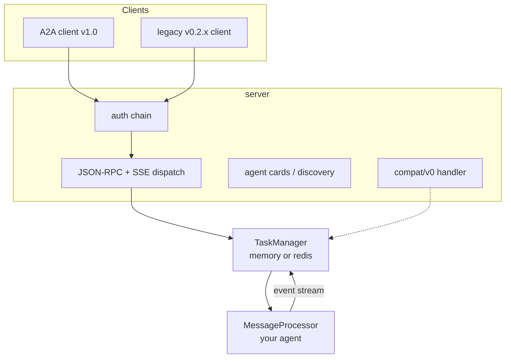
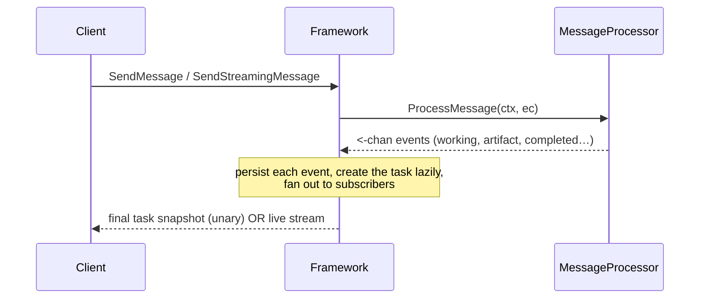

# Framework Overview

tRPC-A2A-Go is the Go implementation of the A2A (Agent-to-Agent) protocol,
v1.0. It gives you both sides of an A2A conversation:

- a **server** that exposes your agent to any A2A client, over JSON-RPC (HTTP
  POST) and SSE streaming, and
- a **client** that calls other agents the same way.

Between the two sits everything stateful — task lifecycle, streaming,
conversation history, authentication, push notifications, multi-tenant hosting
— so the only thing you write is your agent's logic.

## Architecture



Three layers, three responsibilities:

- **server** terminates the wire: authentication, agent-card discovery,
  JSON-RPC dispatch and SSE streaming, and — optionally — the legacy v0.2.x
  endpoint on the same port and auth chain.
- **TaskManager** owns everything stateful: lazy task creation, the round
  close rules, cancellation, conversation history, retention, and subscriber
  fan-out. In-memory and Redis backends ship in-tree; the interface is small
  enough to implement your own.
- **MessageProcessor** is the only part you write: read a request snapshot
  (`ExecContext`), emit events on a channel. That's your agent.

## The core idea: one processor, one event stream

The heart of the v1.0 design is that your agent is a single method:

```go
type MessageProcessor interface {
    ProcessMessage(ctx context.Context, ec *ExecContext) (<-chan protocol.StreamEvent, error)
}
```

You read the incoming request and return a channel of **events** — the task's
event log. You never branch on "is this a streaming request?": the framework
serves `SendMessage` (unary) and `SendStreamingMessage` (SSE) from the *same*
processor code, deriving the blocking response or the live stream from your
events. And the framework — not you — creates and persists the task, applies
the lifecycle rules, and fans events out to subscribers.



This replaced a v0.x design where the processor returned one of several result
shapes *and* drove a task through a callback handle — two write paths that each
did half the work. If you are coming from v0.x, see
[Migrating from v0.x](migration.md).

## Writing the agent — two styles

Both produce the same event stream; pick by taste and by what you are porting.

- **`TaskHandle`** — the familiar verb API (`UpdateTaskState`, `AddArtifact`,
  `Reply`). A synchronous body works as-is. This is the recommended default and
  the shape a v0.x processor ports into. Reference:
  [examples/basic](https://github.com/trpc-group/trpc-a2a-go/tree/v2/examples/basic).
- **Raw channel** — construct `protocol.StreamEvent` values and send them
  yourself. Full control over every field (needed for artifact-append
  chunking). Reference:
  [examples/simple](https://github.com/trpc-group/trpc-a2a-go/tree/v2/examples/simple).

```go
func (p *proc) ProcessMessage(ctx context.Context, ec *taskmanager.ExecContext) (<-chan protocol.StreamEvent, error) {
    h := taskmanager.NewTaskHandle(ctx, ec)
    defer h.Close()
    h.UpdateTaskState(protocol.TaskStateWorking, nil)
    result := doWork(ec.Message)
    h.AddArtifact(result.Artifact, true)
    h.UpdateTaskState(protocol.TaskStateCompleted, taskmanager.ReplyText("done"))
    return h.Events(), nil
}
```

## Feature highlights

- A2A **v1.0** wire protocol: sealed `Task | Message` result unions, agent
  cards, multi-transport interfaces, tenants.
- **One processor, every consumption mode**: blocking send,
  `returnImmediately`, live streaming, and `SubscribeToTask` reattachment.
- **Authentication**: JWT / API key / OAuth2, with chainable providers.
- **Push notifications** signed with JWT, public keys served via a JWKS
  endpoint — for disconnected, webhook-driven operation.
- **Multi-tenant hosting**: one process, many agents, per-tenant agent cards.
- **Pluggable storage**: in-memory and Redis backends in-tree.
- **Legacy compatibility**: unmodified v0.2.x clients keep working via
  `compat/v0`, with the original wire defaults preserved.

## Where to go next

- [Protocol](protocol.md) — learn A2A itself: agent cards, the four wire
  objects, the task state machine, and the interaction flows.
- [Behavior](behavior.md) — the processor contract, round lifecycle,
  cancellation, and history/retention semantics.
- [Usage](usage.md) — build recipes, each linked to a runnable example.
