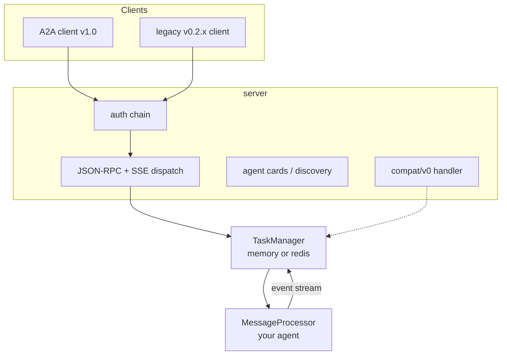
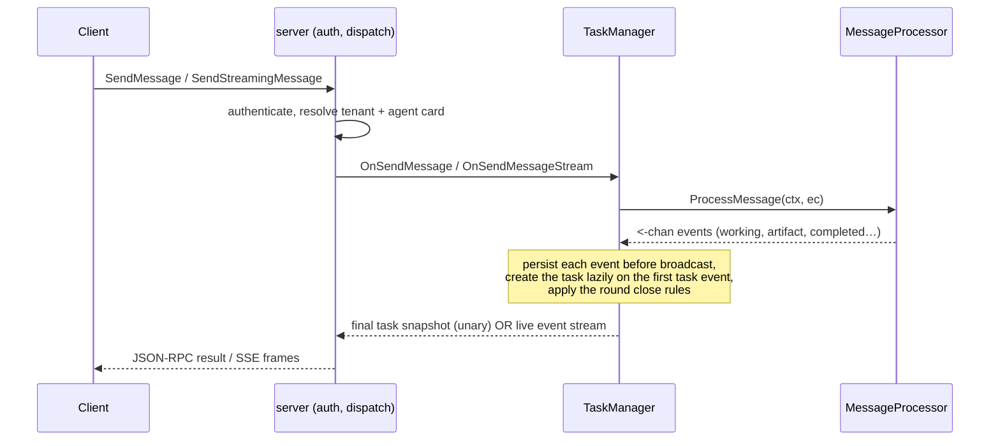

# Framework Overview

tRPC-A2A-Go is the Go implementation of the A2A (Agent-to-Agent) protocol,
v1.0. It gives you both sides of an A2A conversation — a **server** that
exposes your agent and a **client** that calls other agents — and owns
everything stateful in between (task lifecycle, streaming, conversation
history, authentication, push notifications, multi-tenant hosting), so the
only thing you write is your agent's logic.

## What you get

| Capability | Status | Notes |
| --- | --- | --- |
| A2A v1.0 protocol objects, task lifecycle, `Task \| Message` result union | ✅ | The full object and state model of the spec. |
| JSON-RPC transport binding (HTTP POST + SSE) | ✅ | The wire this framework serves. |
| gRPC / HTTP+JSON (REST) transport bindings | 🗺️ Planned | Defined by the spec; not yet implemented — JSON-RPC only today. |
| `SendMessage` / `SendStreamingMessage` from one processor | ✅ | One code path serves unary and streaming. |
| Blocking send, `returnImmediately`, live streaming, `SubscribeToTask` | ✅ | Four client consumption modes over the same agent. |
| In-memory & Redis task stores | ✅ | Pluggable `TaskManager` interface; bring your own. |
| Authentication: JWT · API key · OAuth2 | ✅ | Chainable providers, server and client side. |
| Push notifications (webhooks) signed with JWT + JWKS | ✅ | For disconnected, callback-driven operation. |
| Multi-tenant hosting with per-tenant agent cards | ✅ | One process, many agents, routed by tenant. |
| Legacy v0.2.x wire compatibility | ✅ | `compat/v0` on the same endpoint and auth chain. |
| Telemetry: OpenTelemetry metrics, TTFT tracking | ✅ | Pluggable meter provider and first-token policy. |
| Cross-replica streaming on the Redis backend | 🚧 Partial | Snapshots are shared; live event fan-out is per-process (see [behavior.md](behavior.md)). |

## Architecture



Three layers, three responsibilities:

- **`server`** terminates the wire. It authenticates the request, serves agent
  cards for discovery, dispatches JSON-RPC methods and SSE streams, and —
  optionally — mounts the legacy v0.2.x endpoint on the same port inside the
  same auth chain. Configured through functional options
  (`server.WithAgentCard`, `WithAuthProvider`, `WithJWKSEndpoint`,
  `WithBasePath`, `WithCompatHandler`, `WithMiddleware`, …).
- **`TaskManager`** owns everything stateful: lazy task creation, the round
  close rules, cancellation, conversation history, retention, and subscriber
  fan-out. The `taskmanager` package defines the interface (`OnSendMessage`,
  `OnSendMessageStream`, `OnGetTask`, `OnListTasks`, `OnCancelTask`,
  `OnResubscribe`, and the `OnPushNotification*` set); `taskmanager/memory` and
  `taskmanager/redis` implement it, and you can supply your own.
- **`MessageProcessor`** is the only part you write. It reads a read-only
  request snapshot (`ExecContext`) and returns a channel of events. That is
  your agent.

## The request lifecycle

Every request — unary or streaming — flows through the same pipeline:



The load-bearing idea: **your agent is one method that emits an event stream,
and the framework derives every response shape from it.** There is no
streaming/non-streaming branch in your code; `SendMessage` blocks and returns
the terminal snapshot, `SendStreamingMessage` forwards the events live, and
both come from the same `ProcessMessage`.

## How the framework handles the protocol

A large part of the framework is the protocol work you don't have to do:

- **Result derivation** — `SendMessage` returns a `Task` or a `Message` (the
  sealed union) depending on what your processor emitted, blocking until the
  round ends; `returnImmediately` answers with the first usable result while
  work continues. You just emit events.
- **Lazy task creation & persistence** — the task materializes on the first
  task event and every event is persisted before it is broadcast, so
  `GetTask` never lags what a subscriber saw.
- **Agent card normalization** — cards are emitted with both the v1.0 fields
  (`supportedInterfaces`, `securitySchemes`) and their deprecated v0.2.x
  mirrors, so a single card is readable by both client generations.
- **Stream lifecycle** — SSE streams start with the current task snapshot on
  resubscribe, end at a terminal/interrupted state, and are drained on client
  disconnect without cancelling the detached work.
- **Legacy translation** — `compat/v0` maps the v0.2.x slash-method wire onto
  the same `TaskManager`, preserving the old defaults (notably non-blocking
  `message/send`).

The exact contract — round lifecycle, cancellation, history and retention
semantics, and where behavior is a deliberate choice on top of the spec — is
[behavior.md](behavior.md).

## Writing the agent — two styles

Both produce the same event stream; pick by taste and by what you are porting.

- **`TaskHandle`** — the familiar verb API (`UpdateTaskState`, `AddArtifact`,
  `Reply`). A synchronous body works as-is. The recommended default and the
  shape a v0.x processor ports into.
  → [examples/basic](https://github.com/trpc-group/trpc-a2a-go/tree/v2/examples/basic)
- **Raw channel** — construct `protocol.StreamEvent` values and send them
  yourself. Full control over every field (needed for artifact-append
  chunking).
  → [examples/simple](https://github.com/trpc-group/trpc-a2a-go/tree/v2/examples/simple)

```go
func (p *proc) ProcessMessage(ctx context.Context, ec *taskmanager.ExecContext) (<-chan protocol.StreamEvent, error) {
    h := taskmanager.NewTaskHandle(ctx, ec)
    defer h.Close()
    h.UpdateTaskState(protocol.TaskStateWorking, nil)
    result := doWork(ec.Message)
    h.AddArtifact(result.Artifact, true)
    h.UpdateTaskState(protocol.TaskStateCompleted, taskmanager.ReplyText("done"))
    return h.Events(), nil
}
```

## Roadmap

- **gRPC and HTTP+JSON (REST) transport bindings** — the spec defines all
  three; this framework serves the JSON-RPC binding today, and the agent card
  already models multi-transport declaration for when the others land.
- **Redis cross-replica streaming** — live event fan-out is currently
  per-process; a shared pub/sub bridge is the planned path to full multi-replica
  streaming.

## Where to go next

- [Protocol](protocol.md) — learn A2A itself: agent cards, the four wire
  objects, the task state machine, and the interaction flows.
- [Behavior](behavior.md) — the processor contract, round lifecycle,
  cancellation, and history/retention semantics.
- [Usage](usage.md) — build recipes for every capability, each linked to a
  runnable example.
- [Migrating from v0.x](migration.md) — port an existing v0.x agent.
