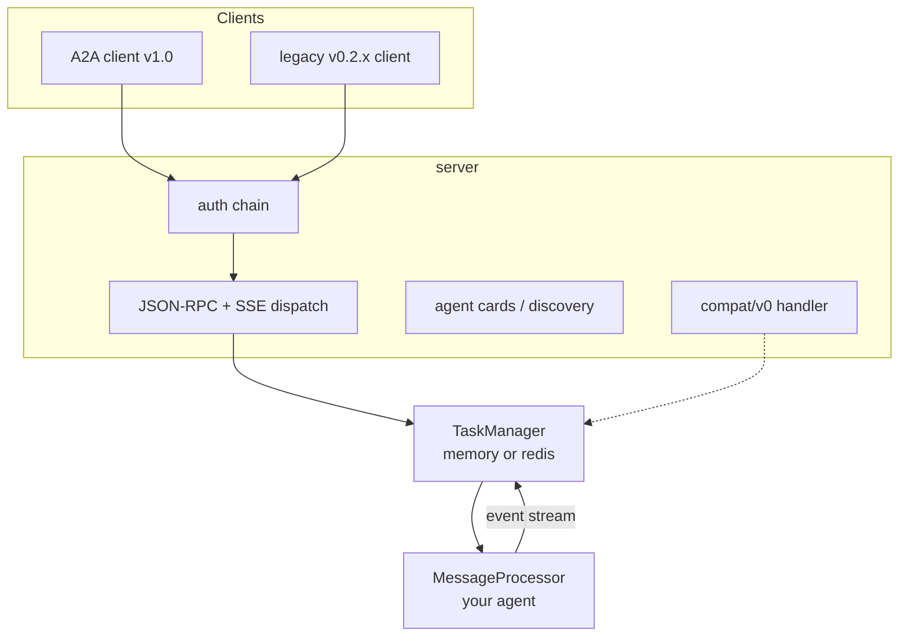
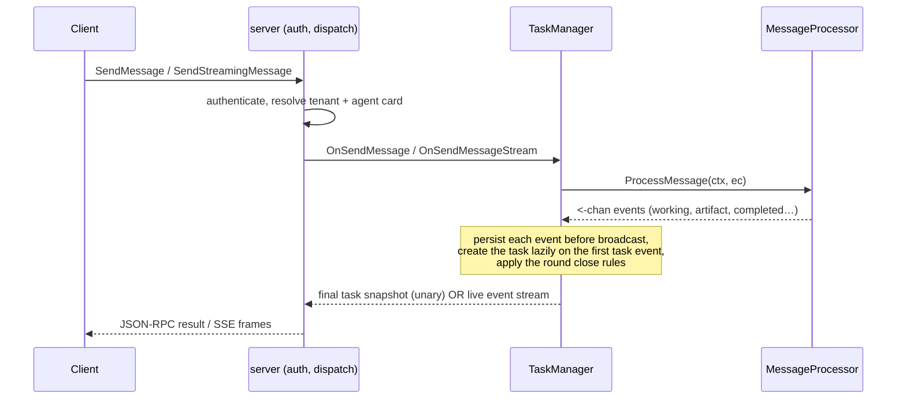

# Framework Overview

tRPC-A2A-Go is the Go implementation of the A2A (Agent-to-Agent) protocol,
v1.0. It gives you both sides of an A2A conversation — a **server** that
exposes your agent and a **client** that calls other agents — and owns
everything stateful in between (task lifecycle, streaming, conversation
history, authentication, push notifications, multi-tenant hosting), so the
only thing you write is your agent's logic.

For the A2A protocol itself see [Protocol](protocol.md); for build recipes and
the runtime contract see [Server](server.md) and [Client](client.md).

## What you get

| Capability | Status | Notes |
| --- | --- | --- |
| A2A v1.0 protocol objects, task lifecycle, `Task \| Message` result union | ✅ | The full object and state model of the spec. |
| JSON-RPC transport binding (HTTP POST + SSE) | ✅ | The wire this framework serves. |
| gRPC / HTTP+JSON (REST) transport bindings | 🗺️ Planned | Defined by the spec; not yet implemented — JSON-RPC only today. |
| `SendMessage` / `SendStreamingMessage` from one processor | ✅ | One code path serves unary and streaming. |
| Blocking send, `returnImmediately`, live streaming, `SubscribeToTask` | ✅ | Four client consumption modes over the same agent. |
| In-memory & Redis task stores | ✅ | Pluggable `TaskManager` interface; bring your own. |
| Authentication: JWT · API key · OAuth2 | ✅ | Chainable providers, server and client side. |
| Push notifications (webhooks) signed with JWT + JWKS | ✅ | For disconnected, callback-driven operation. |
| Multi-tenant hosting with per-tenant agent cards | ✅ | One process, many agents, routed by tenant. |
| Legacy v0.2.x wire compatibility | ✅ | `compat/v0` on the same endpoint and auth chain. |
| Telemetry: OpenTelemetry metrics, TTFT tracking | ✅ | Pluggable meter provider and first-token policy. |
| Cross-replica streaming on the Redis backend | 🚧 Partial | Snapshots are shared; live event fan-out is per-process. |

## Architecture

Three layers, three responsibilities:

- **`server`** terminates the wire. It authenticates the request, serves agent
  cards for discovery, dispatches JSON-RPC methods and SSE streams, and —
  optionally — mounts the legacy v0.2.x endpoint on the same port inside the
  same auth chain.
- **`TaskManager`** owns everything stateful: lazy task creation, the round
  close rules, cancellation, conversation history, retention, and subscriber
  fan-out. `taskmanager/memory` and `taskmanager/redis` implement the
  interface, and you can supply your own.
- **`MessageProcessor`** is the only part you write. It reads a read-only
  request snapshot (`ExecContext`) and returns a channel of events. That is
  your agent.

## The request lifecycle

Every request — unary or streaming — flows through the same pipeline:

The load-bearing idea: **your agent is one method that emits an event stream,
and the framework derives every response shape from it.** There is no
streaming/non-streaming branch in your code; `SendMessage` blocks and returns
the terminal snapshot, `SendStreamingMessage` forwards the events live, and
both come from the same `ProcessMessage`. You write it by wrapping a
`TaskHandle` — see [Server](server.md#defining-the-messageprocessor).

## What the framework does for you

A large part of the framework is the protocol work you don't have to do:

- **Result derivation** — `SendMessage` returns a `Task` or a `Message` (the
  sealed union) from what your processor emitted; `SendStreamingMessage`
  forwards the events live. One processor, every response shape.
- **Lazy task creation & persistence** — the task materializes on the first
  task event, and every event is persisted before it is broadcast.
- **Agent card normalization** — cards carry both the v1.0 fields and their
  deprecated v0.2.x mirrors, so one card is readable by both client
  generations.
- **Legacy translation** — `compat/v0` maps the v0.2.x slash-method wire onto
  the same `TaskManager`, preserving the old defaults.

The exact runtime contract — round lifecycle, cancellation, history and
retention semantics — lives with the agent-author guide in
[Server](server.md#the-round-contract).

## Roadmap

- **gRPC and HTTP+JSON (REST) transport bindings** — the spec defines all
  three; this framework serves the JSON-RPC binding today, and the agent card
  already models multi-transport declaration for when the others land.
- **Redis cross-replica streaming** — live event fan-out is currently
  per-process; a shared pub/sub bridge is the planned path to full multi-replica
  streaming.

## Where to go next

- [Protocol](protocol.md) — learn A2A itself: agent cards, the four wire
  objects, the task state machine, and the interaction flows.
- [Server](server.md) — build an agent: the server, the processor, the runtime
  contract, and every server-side capability.
- [Client](client.md) — call agents: the consumption modes, task management,
  and orchestration.
- [Migrating from v0.x](migration.md) — port an existing v0.x agent.
