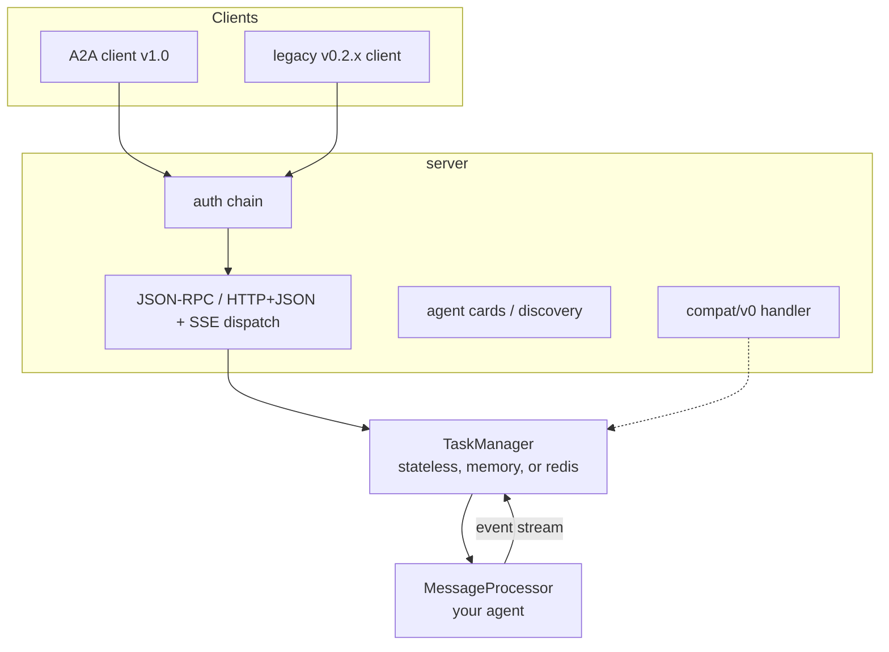

# Framework Overview

tRPC-A2A-Go is the Go implementation of the A2A (Agent-to-Agent) protocol,
v1.0. It gives you both sides of an A2A conversation — a **server** that
exposes your agent and a **client** that calls other agents — and owns
the protocol plumbing in between (task lifecycle, streaming, conversation
history, authentication, push notifications, multi-tenant hosting). State can
be retained in memory or Redis, or kept request-local with no persistence.

For the A2A protocol itself see [Protocol](protocol.md); for build recipes and
the runtime contract see [Server](server.md) and [Client](client.md).

## What you get

| Capability | Status | Notes |
| --- | --- | --- |
| A2A v1.0 protocol objects, task lifecycle, `Task \| Message` result union | ✅ | The full object and state model of the spec. |
| JSON-RPC transport binding (HTTP POST + SSE) | ✅ | Uses `application/json` and JSON-RPC envelopes. |
| HTTP+JSON (REST) transport binding | ✅ | Uses REST routes, `application/a2a+json`, direct JSON responses, and raw SSE data. |
| gRPC transport binding | 🗺️ Planned | Defined by the spec; not yet implemented. |
| `SendMessage` / `SendStreamingMessage` from one processor | ✅ | One code path serves unary and streaming. |
| Blocking send, `returnImmediately`, live streaming, `SubscribeToTask` | ✅ | Four client consumption modes over the same agent. |
| Stateless request-scoped execution | ✅ | Direct Messages and ephemeral Tasks with no retained state or conversation history. |
| In-memory & Redis task stores | ✅ | Pluggable `TaskManager` interface; bring your own. |
| Authentication: JWT · API key · OAuth2 | ✅ | Chainable providers, server and client side. |
| Push notifications (webhooks) signed with JWT + JWKS | ✅ | For disconnected, callback-driven operation. |
| Multi-tenant hosting with per-tenant agent cards | ✅ | One process, many agents, routed by tenant. |
| Legacy v0.2.x wire compatibility | ✅ | `compat/v0` on the same endpoint and auth chain. |
| Telemetry: OpenTelemetry metrics, TTFT tracking | ✅ | Pluggable meter provider and first-token policy. |
| Cross-node `SubscribeToTask` on Redis | ✅ Opt-in | Enable `WithCrossNodeResubscribe(true)` on every replica sharing Redis. |

## Architecture



Three layers, three responsibilities:

- **`server`** terminates the wire. It authenticates requests, serves agent cards for discovery, dispatches JSON-RPC and HTTP+JSON operations and SSE streams, and — optionally — mounts the legacy v0.2.x endpoint on the same port inside the same auth chain.
- **`TaskManager`** owns execution policy and, when enabled, task state: lazy
  task creation, round close rules, cancellation, conversation history,
  retention, and subscriber fan-out. `taskmanager/stateless` derives direct
  Messages or request-local Tasks without retaining state;
  `taskmanager/memory` and `taskmanager/redis` provide cross-request task
  capabilities. You can also supply your own implementation.
- **`MessageProcessor`** is the only part you write. It reads a read-only
  request snapshot (`ExecContext`) and returns a channel of events. That is
  your agent.

## The request lifecycle

Every request — unary or streaming — flows through the same pipeline:

```mermaid
sequenceDiagram
    participant Client
    participant Server as server (auth, dispatch)
    participant TM as TaskManager
    participant P as MessageProcessor

    Client->>Server: SendMessage / SendStreamingMessage
    Server->>Server: authenticate, resolve tenant + agent card
    Server->>TM: OnSendMessage / OnSendMessageStream
    TM->>P: ProcessMessage(ctx, ec)
    P-->>TM: <-chan events (Message / status / artifact)
    Note over TM: memory/Redis persist task events;<br/>stateless applies them to a request-local Task only
    TM-->>Server: Task or Message (unary) OR live event stream
    Server-->>Client: binding-specific result / SSE frames
```

The load-bearing idea: **your agent is one method that emits an event stream,
and the framework derives every response shape from it.** There is no
streaming/non-streaming branch in your code; `SendMessage` blocks and returns
the terminal snapshot, `SendStreamingMessage` forwards the events live, and
both come from the same `ProcessMessage`. You write it by wrapping a
`TaskHandle` — see [Server](server.md#defining-the-messageprocessor).

## What the framework does for you

A large part of the framework is the protocol work you don't have to do:

- **Result derivation** — `SendMessage` returns a `Task` or a `Message` (the
  sealed union) from what your processor emitted; `SendStreamingMessage`
  forwards the events live. One processor, every response shape.
- **Lazy task creation & optional persistence** — a task materializes on the
  first task event. Memory and Redis persist it before broadcast; stateless
  keeps the snapshot only until the originating request ends.
- **Agent card normalization** — cards carry both the v1.0 fields and their
  deprecated v0.2.x mirrors, so one card is readable by both client
  generations.
- **Legacy translation** — `compat/v0` maps the v0.2.x slash-method wire onto
  the same `TaskManager`, preserving the old defaults.

The exact runtime contract — round lifecycle, cancellation, history and
retention semantics — lives with the agent-author guide in
[Server](server.md#the-round-contract).

## Roadmap

- **gRPC transport binding** — the spec defines it alongside JSON-RPC and HTTP+JSON; this framework does not serve gRPC yet.
- **Redis execution coordination** — cross-node `SubscribeToTask` is available,
  but continuation, live cancel, and single-writer execution routing remain
  node-local concerns rather than a distributed work queue.

## Where to go next

- [Protocol](protocol.md) — learn A2A itself: agent cards, the four wire
  objects, the task state machine, and the interaction flows.
- [Server](server.md) — build an agent: the server, the processor, the runtime
  contract, and every server-side capability.
- [Client](client.md) — call agents: the consumption modes, task management,
  and orchestration.
- [Migrating from v0.x](migration.md) — port an existing v0.x agent.
