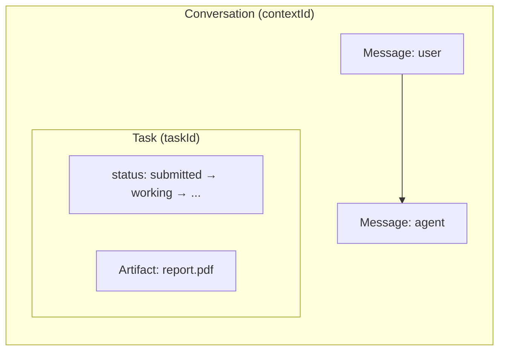
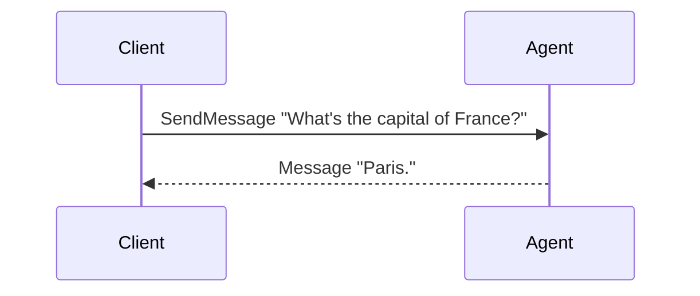
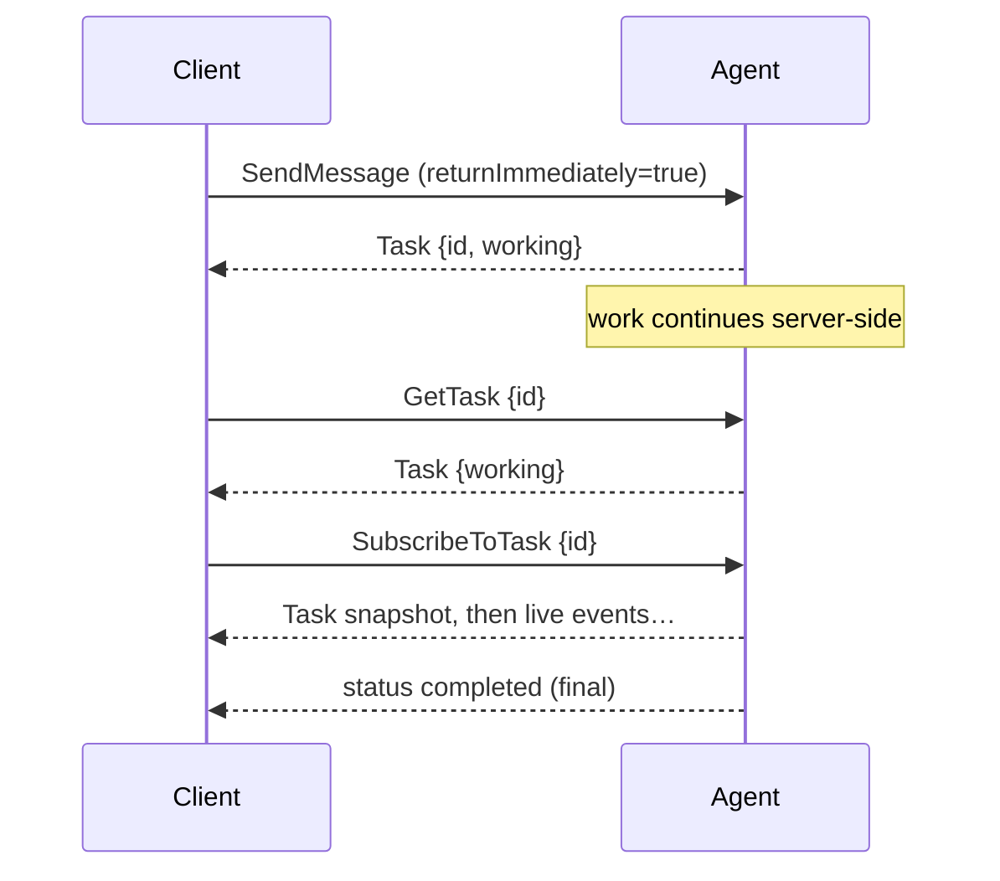
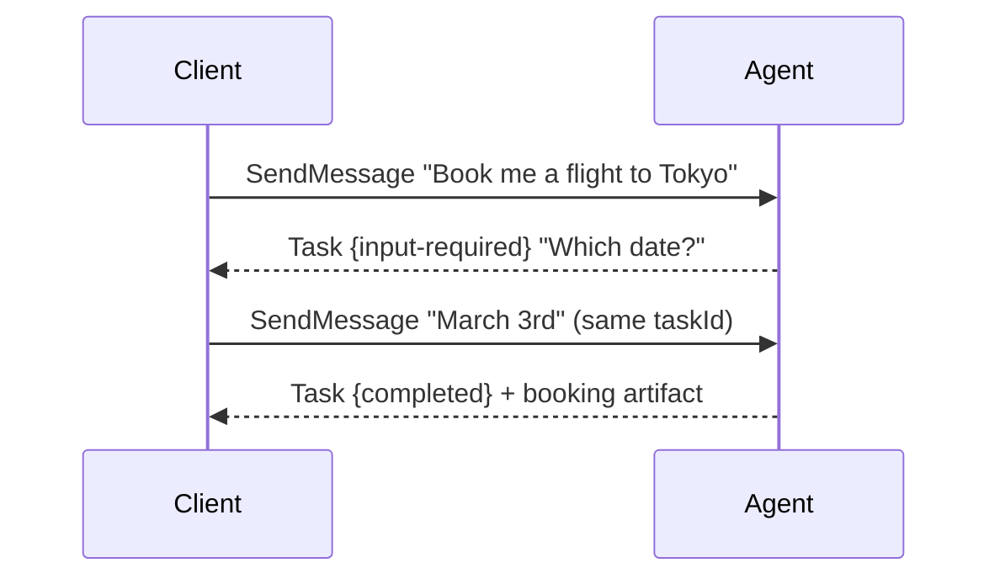
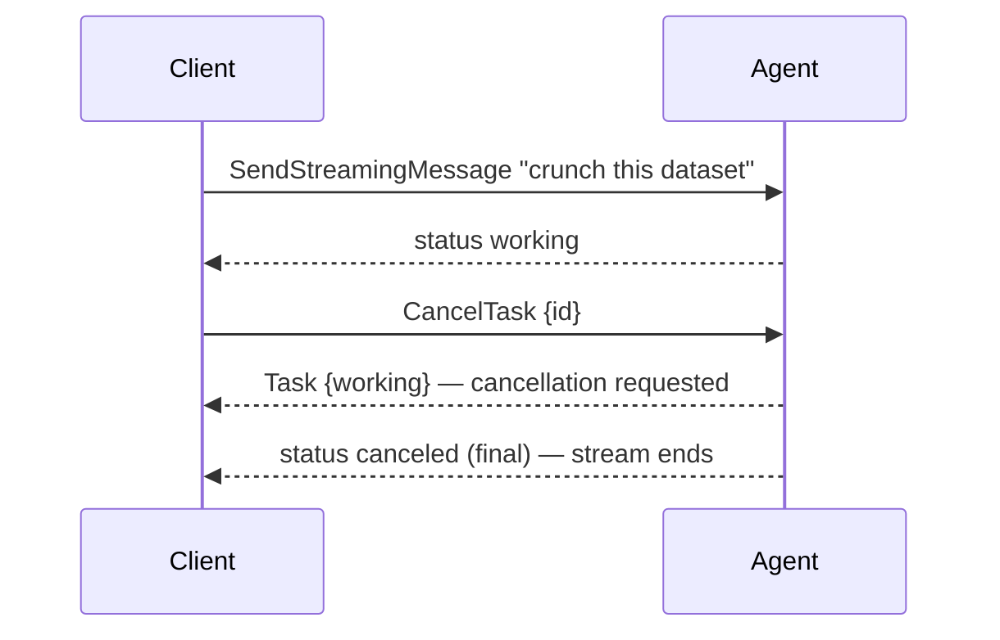
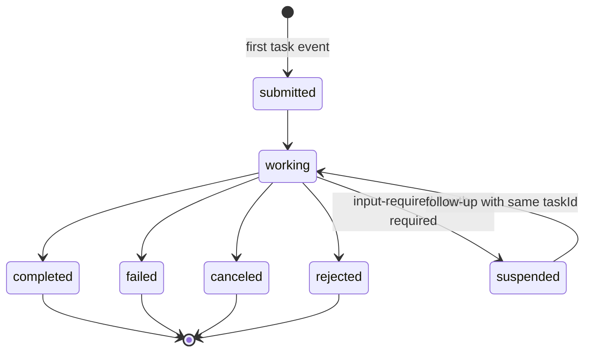

# Understanding the A2A Protocol

This page explains A2A from the user's seat: the problem it solves, the mental
model, the interactions you will actually have with an agent — and only then
the formal object and RPC definitions. How this framework implements the
protocol is covered in [behavior.md](behavior.md).

## What problem does A2A solve?

AI agents are becoming services: a report generator, a travel booker, a code
reviewer — each built by a different team, on a different framework, in a
different language, often in a different organization. A2A (Agent-to-Agent) is
the open protocol that lets any client talk to any such agent without knowing
how it is built:

- a **product backend** calling one remote agent for answers,
- a **long-running job** (generate a report, process a dataset) that streams
  progress, survives disconnects, and can be picked up again,
- a **form-like exchange** where the agent has to ask follow-up questions,
- an **orchestrator agent** fanning work out to specialist agents,
- **cross-organization** calls that need authentication and webhooks.

The transport is deliberately boring: the client fetches the agent's
**agent card** (`/.well-known/agent-card.json`) to learn its identity, skills
and capabilities, then speaks JSON-RPC — unary calls over HTTP POST, streaming
over SSE. trpc-a2a-go implements A2A **v1.0** (the legacy v0.2.x wire is kept
alive by [compat/v0](https://github.com/trpc-group/trpc-a2a-go/tree/v2/compat/v0)).

## The mental model

Everything in A2A hangs off two nouns:

- a **conversation** (`contextId`) — the ongoing exchange between you and the
  agent, spanning any number of questions and jobs;
- a **task** (`taskId`) — one tracked unit of work inside that conversation,
  with a lifecycle you can observe, resume, and cancel.

And there are exactly two kinds of content:

> **Messages are talking, artifacts are delivering.** A question, an answer,
> a clarification — that's a `Message`. The report, the code, the dataset the
> task produced — that's an `Artifact`, attached to the task.



Not every exchange creates a task. A quick answer is just a `Message` back —
no lifecycle, no cleanup. The agent opens a task only when there is work worth
tracking; from then on, everything the agent reports is an **event**: a status
update (progress) or an artifact update (deliverable chunk).

## The interactions, one scenario at a time

### 1. Quick answer — no task at all

The simplest exchange: `SendMessage`, and the agent answers with a plain
message. Nothing to track, nothing left behind.



### 2. A tracked job with live progress

Same request shape, the streaming endpoint: every event reaches you the moment
it happens. The first task event is where the task comes into existence.


Prefer one blocking call instead? Plain `SendMessage` waits by default and
returns the final task snapshot, artifacts included.

### 3. Don't want to wait — answer now, follow up later

Set `returnImmediately=true` and the server answers with the earliest usable
result while the work runs on. Poll `GetTask`, or reattach with
`SubscribeToTask` — its first frame is always the current task snapshot, so
whatever you missed while away is already absorbed into it.



For fully disconnected operation, register a webhook
(`CreateTaskPushNotificationConfig`) and let the server call you.

### 4. The agent needs more from you — multi-turn

When the agent cannot proceed, it parks the task in `input-required` (or
`auth-required`) and asks. You resume by sending a message **with the same
`taskId`** — that is the one rule of multi-turn. A follow-up without the
`taskId` starts a brand-new task and leaves the old one waiting forever.



### 5. Changing your mind — cancellation

`CancelTask` asks the agent to stop. The response is the task as it was at
that moment (often still `working`); the terminal `CANCELED` state lands when
the agent winds down. Already-finished tasks cannot be canceled (`-32002`).



---

## Protocol reference

The definitions behind the scenarios above.

### The four wire objects

| Object | Role | One-liner |
| --- | --- | --- |
| **Message** | **Communication** | One conversational turn: `role` (user/agent), `parts` (text/file/data), `messageId`, optional `taskId`/`contextId`. |
| **Task** | **The unit of work** | A stateful record: `id`, `contextId`, `status`, `artifacts[]`, `history[]`. Created by the server, immutable once terminal. |
| **TaskStatusUpdateEvent** | **Progress** | Announces a state transition; may carry an explanatory `message`; `final=true` marks the round's last status frame. |
| **TaskArtifactUpdateEvent** | **Deliverables** | Carries an `Artifact`. Chunked streaming uses `append` (continue the previous chunk) and `lastChunk`. |

Two identifiers glue everything together: **`contextId`** names the
conversation (server-generated when absent; one context spans many tasks) and
**`taskId`** names one unit of work (echoing it resumes a waiting task). Two
spec rules follow: an agent **MUST reject** a message whose `contextId` does
not match the targeted task's, and a message can point at related tasks
*without* resuming them via the optional `referenceTaskIds` field.

### The task state machine



Terminal states (`completed`/`failed`/`canceled`/`rejected`) are **immutable**:
nothing may modify such a task, and subscribing to one is rejected. The spec
calls `input-required`/`auth-required` **interrupted** states — processing
paused awaiting client action; the wire enum also carries a
`TASK_STATE_UNSPECIFIED` placeholder for indeterminate states.

### The RPC surface (v1.0)

JSON-RPC method names as defined by the v1.0 binding (the v0.2.x wire used
slash-delimited names, shown for reference):

| Method (v1.0) | Kind | Purpose | v0.2.x name |
| --- | --- | --- | --- |
| `SendMessage` | unary | Send a message; the response is a **`Task` or a `Message`** (a union). By default it **waits** for the round to finish. | `message/send` |
| `SendStreamingMessage` | SSE | Same request; every event streams live. | `message/stream` |
| `GetTask` | unary | Fetch a task snapshot; `historyLength` shapes attached history. | `tasks/get` |
| `ListTasks` | unary | Enumerate tasks: filter by `contextId`/state, paginate. | — (new in v1.0) |
| `CancelTask` | unary | Request cancellation. | `tasks/cancel` |
| `SubscribeToTask` | SSE | Reattach to a live task's stream: snapshot first, then increments. | `tasks/resubscribe` |
| `CreateTaskPushNotificationConfig` / `Get…` / `List…` / `Delete…` | unary | Webhook config CRUD, for disconnected operation. | `tasks/pushNotificationConfig/*` |
| `GetExtendedAgentCard` | unary | Authenticated agent card with extended metadata. | `agent/getAuthenticatedExtendedCard` |

### Blocking vs `returnImmediately`

`SendMessage` takes an optional `configuration.returnImmediately`:

> If `false` (**default**), the operation MUST wait until the task reaches a
> terminal (COMPLETED, FAILED, CANCELED, REJECTED) or interrupted
> (INPUT_REQUIRED, AUTH_REQUIRED) state before returning.

> **v0.2.x note**: the old wire had the *opposite* default — `blocking` was
> optional and absent meant "answer immediately". v1.0 inverted it. The compat
> layer preserves the old default for legacy clients; migrating clients must
> opt in explicitly (see the
> [migration guide](https://github.com/trpc-group/trpc-a2a-go/blob/v2/README.md#migrating-from-v0x)).

### The canonical event paradigm

The typical shape of a task-producing round, and what is actually mandatory:

```
status  -> submitted     optional: creation implies submitted
status  -> working       conventional; the natural "accepted" signal
artifact-> chunk 1..N    append/lastChunk for chunks of one artifact
status  -> completed     REQUIRED to end well; carries final=true
```

Mandatory: end in a legal state (terminal, or a suspend state for
multi-turn), `final=true` on the closing status frame, artifact chunk flags.
Everything else — an explicit `submitted`, how many `working` frames, whether
progress text rides on status messages — is the agent's choice.
