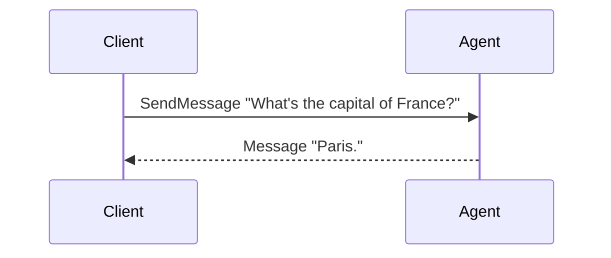
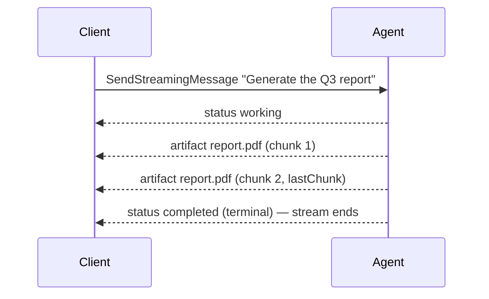
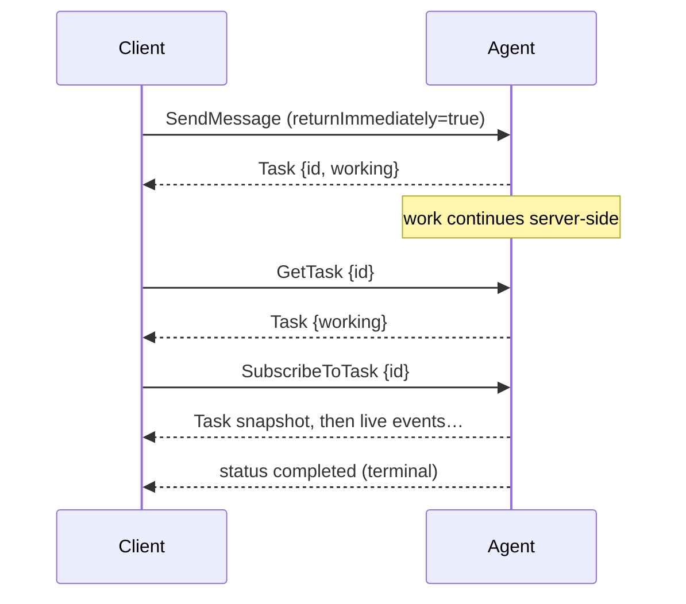
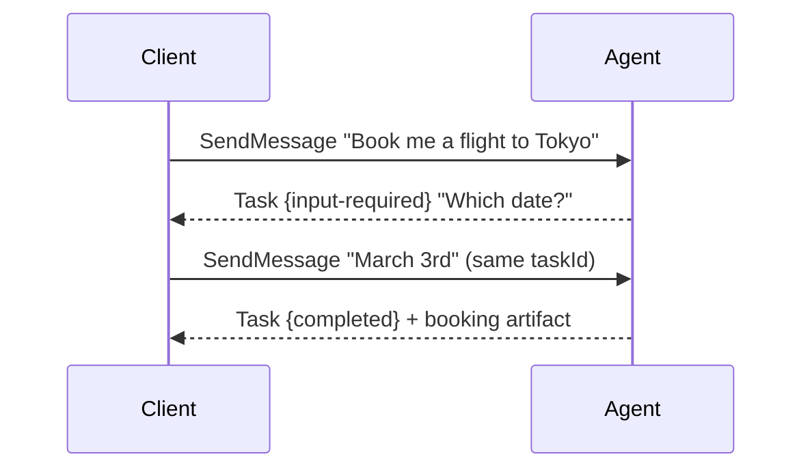
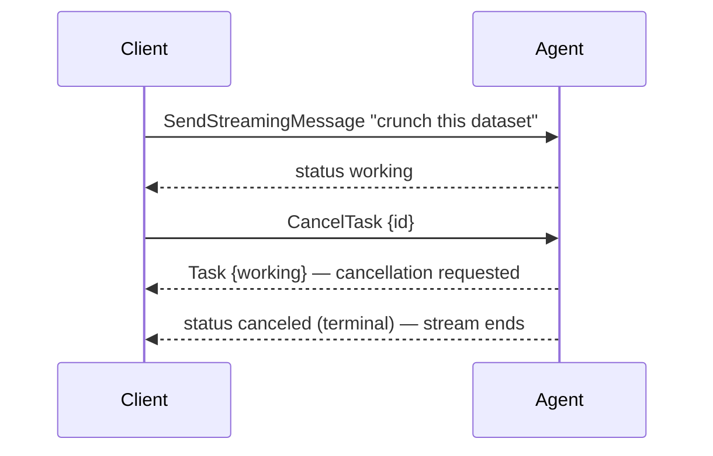
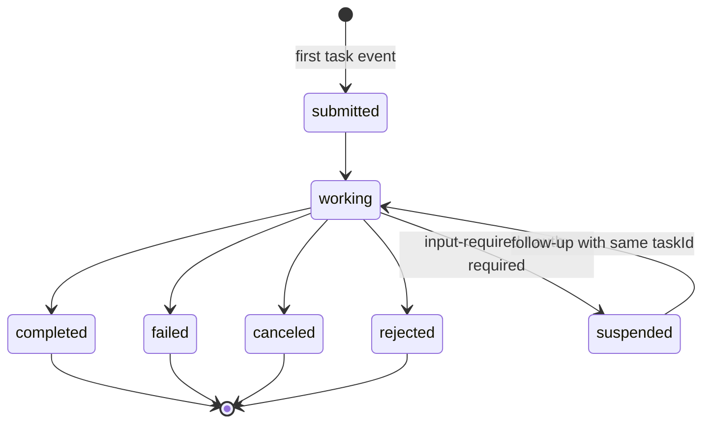

# Understanding the A2A Protocol

This page explains A2A from the user's seat: the problem it solves, the mental
model, how you discover an agent, the interactions you will actually have with
one — and only then the formal object and RPC definitions. How this framework
implements the protocol is covered in [Server: the round contract](server.md#the-round-contract).

## What problem does A2A solve?

AI agents are becoming services: a report generator, a travel booker, a code
reviewer — each built by a different team, on a different framework, in a
different language, often in a different organization. A2A (Agent-to-Agent) is
the open protocol that lets any client talk to any such agent without knowing
how it is built:

- a **product backend** calling one remote agent for answers,
- a **long-running job** (generate a report, process a dataset) that streams
  progress, survives disconnects, and can be picked up again,
- a **form-like exchange** where the agent has to ask follow-up questions,
- an **orchestrator agent** fanning work out to specialist agents,
- **cross-organization** calls that need authentication and webhooks.

The transport is deliberately boring: the client fetches the agent's **agent
card** to learn its identity, skills and capabilities, then speaks JSON-RPC —
unary calls over HTTP POST, streaming over SSE. trpc-a2a-go implements A2A
**v1.0** (the legacy v0.2.x wire is kept alive by
[compat/v0](https://github.com/trpc-group/trpc-a2a-go/tree/v2/compat/v0)).

## The mental model

Everything in A2A hangs off two nouns:

- a **conversation** (`contextId`) — the ongoing exchange between you and the
  agent, spanning any number of questions and jobs;
- a **task** (`taskId`) — one tracked unit of work inside that conversation,
  with a lifecycle you can observe, resume, and cancel.

And there are exactly two kinds of content:

> **Messages are talking, artifacts are delivering.** A question, an answer,
> a clarification — that's a `Message`. The report, the code, the dataset the
> task produced — that's an `Artifact`, attached to the task.


Not every exchange creates a task. A quick answer is just a `Message` back —
no lifecycle, no cleanup. The agent opens a task only when there is work worth
tracking; from then on, everything the agent reports is an **event**: a status
update (progress) or an artifact update (deliverable chunk).

## Discovery: the Agent Card

Before a client can call an agent it needs to know the agent exists, where it
lives, what it can do, and how to authenticate. That is the **Agent Card** — a
JSON document the agent publishes at a well-known path:

```
GET https://agent.example.com/.well-known/agent-card.json
```

The card is the entry point for the whole protocol. A client fetches it once,
learns everything it needs, and proceeds. Its main sections:

| Section | Fields | What it tells the client |
| --- | --- | --- |
| **Identity** | `name`, `description`, `version`, `provider`, `iconUrl`, `documentationUrl` | Who this agent is. |
| **Transport** | `supportedInterfaces[]` (each: `url`, `protocolBinding`, `protocolVersion`, optional `tenant`) | Where and how to call it. The first interface is preferred. |
| **Capabilities** | `capabilities.streaming`, `.pushNotifications`, `.extendedAgentCard`, `.extensions` | Which optional features it supports. |
| **Skills** | `skills[]` (each: `id`, `name`, `description`, `tags`, `examples`, `inputModes`, `outputModes`) | What it can actually do, in discrete advertised capabilities. |
| **I/O modes** | `defaultInputModes`, `defaultOutputModes` | The media types it accepts and produces by default (e.g. `"text"`). |
| **Security** | `securitySchemes`, `securityRequirements` | How to authenticate (API key / HTTP / OAuth2 / OIDC / mTLS). |

A minimal card as this framework builds it:

```go
agentCard := server.AgentCard{
    Name:        "Text Reversal Agent",
    Description: "Reverses text input",
    URL:         "http://localhost:8080/",   // becomes a supportedInterfaces entry
    Version:     "1.0.0",
    Capabilities: server.AgentCapabilities{
        Streaming: boolPtr(true),
    },
    DefaultInputModes:  []string{"text"},
    DefaultOutputModes: []string{"text"},
    Skills: []server.AgentSkill{{
        ID:          "reverse",
        Name:        "Text Reverser",
        Description: stringPtr("Input: reverse hello → Output: olleh"),
        Tags:        []string{"text"},
    }},
}
```

Two related notions:

- **Extended card** — an agent may serve a richer card *after* the client
  authenticates (skills or details it does not want public). The client fetches
  it with `GetExtendedAgentCard`; the public card advertises this via
  `capabilities.extendedAgentCard`.
- **Multi-transport** — `supportedInterfaces` can list several bindings
  (JSON-RPC, gRPC, REST) and, in this framework, per-tenant URLs; the client
  picks the first it supports.
- **Extensions** — URI-identified protocol extensions an agent declares in
  `capabilities.extensions`; a client opts into them per request, and an agent
  may mark one `required` (a missing opt-in is `-32008`).
- **Signatures** — a card MAY be JWS-signed (`signatures`) so a client can
  verify it was not tampered with.

## The interactions, one scenario at a time

### 1. Quick answer — no task at all

The simplest exchange: `SendMessage`, and the agent answers with a plain
message. Nothing to track, nothing left behind.



### 2. A tracked job with live progress

Same request shape, the streaming endpoint: every event reaches you the moment
it happens. The first task event is where the task comes into existence.



Prefer one blocking call instead? Plain `SendMessage` waits by default and
returns the final task snapshot, artifacts included.

### 3. Don't want to wait — answer now, follow up later

Set `returnImmediately=true` and the server answers with the earliest usable
result while the work runs on. Poll `GetTask`, or reattach with
`SubscribeToTask` — its first frame is always the current task snapshot, so
whatever you missed while away is already absorbed into it.



For fully disconnected operation, register a webhook
(`CreateTaskPushNotificationConfig`) and let the server call you.

### 4. The agent needs more from you — multi-turn

When the agent cannot proceed, it parks the task in `input-required` (or
`auth-required`) and asks. You resume by sending a message **with the same
`taskId`** — that is the one rule of multi-turn. A follow-up without the
`taskId` starts a brand-new task and leaves the old one waiting forever.



### 5. Changing your mind — cancellation

`CancelTask` asks the agent to stop. The response is the task as it was at
that moment (often still `working`); the terminal `CANCELED` state lands when
the agent winds down. Already-finished tasks cannot be canceled (`-32002`).



---

## Protocol reference

The definitions behind the scenarios above.

### The four wire objects

| Object | Role | One-liner |
| --- | --- | --- |
| **Message** | **Communication** | One conversational turn. |
| **Task** | **The unit of work** | A stateful, observable record. |
| **TaskStatusUpdateEvent** | **Progress** | A state-transition announcement. |
| **TaskArtifactUpdateEvent** | **Deliverables** | A produced artifact (or chunk). |

**Message** — required `messageId`, `role` (user/agent), `parts`; optional
`taskId` (target/continue a task), `contextId` (the conversation),
`referenceTaskIds` (point at related tasks without resuming them),
`extensions`, `metadata`.

**Task** — required `id`, `status`; plus `contextId`, `artifacts[]`,
`history[]` (messages exchanged during the task; not every message is
guaranteed to be persisted — retention is implementation-defined), `metadata`.

**TaskStatusUpdateEvent** — `taskId`, `contextId`, `status` (a `TaskStatus`
carrying the `state` and an optional explanatory `message`), `metadata`. The
v1.0 wire has no explicit `final` flag: the frame whose `state` is terminal
(or an interrupted state) is the last one, and the SSE stream then closes.

**TaskArtifactUpdateEvent** — `taskId`, `contextId`, `artifact`, and two chunk
flags: `append` (this event continues the previous chunk of the same artifact
rather than starting a new one) and `lastChunk` (the final chunk).

Two identifiers glue everything together: **`contextId`** names the
conversation (server-generated when absent; one context spans many tasks) and
**`taskId`** names one unit of work (echoing it resumes a waiting task). A spec
rule follows: an agent **MUST reject** a message whose `contextId` does not
match the targeted task's.

### Parts: what a message or artifact carries

Both messages and artifacts carry a list of **parts**, so a single turn can mix
text, files and structured data:

| Part | Carries | Constructor |
| --- | --- | --- |
| **Text** | a UTF-8 string | `protocol.NewTextPart(text)` |
| **File** | a file by URL + filename + media type (or raw bytes) | `protocol.NewFilePart(url, name, mediaType)` / `NewRawPart(bytes, mediaType)` |
| **Data** | arbitrary structured JSON | `protocol.NewDataPart(value)` |

`defaultInputModes` / `defaultOutputModes` on the agent card, and
`acceptedOutputModes` on a request, negotiate which media types flow. Output
negotiation is advisory; an unsupported *input* content type is a hard error
(`-32005`).

### The task state machine



| State (wire enum) | Kind | Meaning |
| --- | --- | --- |
| `TASK_STATE_SUBMITTED` | active | acknowledged, not yet started |
| `TASK_STATE_WORKING` | active | actively being processed |
| `TASK_STATE_INPUT_REQUIRED` | interrupted | needs more input from the client |
| `TASK_STATE_AUTH_REQUIRED` | interrupted | needs authentication to proceed |
| `TASK_STATE_COMPLETED` | terminal | finished successfully |
| `TASK_STATE_FAILED` | terminal | finished with an error |
| `TASK_STATE_CANCELED` | terminal | canceled before completion |
| `TASK_STATE_REJECTED` | terminal | the agent declined the task |
| `TASK_STATE_UNSPECIFIED` | — | placeholder for an indeterminate state |

**Terminal** states are immutable: nothing may modify such a task, and
subscribing to one is rejected. **Interrupted** states pause processing
awaiting client action (a follow-up message, or authentication).

### The RPC surface (v1.0)

JSON-RPC method names as defined by the v1.0 binding (the v0.2.x wire used
slash-delimited names, shown for reference):

| Method (v1.0) | Kind | Purpose | v0.2.x name |
| --- | --- | --- | --- |
| `SendMessage` | unary | Send a message; the response is a **`Task` or a `Message`** (a union). By default it **waits** for the round to finish. | `message/send` |
| `SendStreamingMessage` | SSE | Same request; one Message, or Task first then live status/artifact updates. | `message/stream` |
| `GetTask` | unary | Fetch a task snapshot; `historyLength` shapes attached history. | `tasks/get` |
| `ListTasks` | unary | Enumerate tasks: filter by `contextId`/state, paginate. | — (new in v1.0) |
| `CancelTask` | unary | Request cancellation. | `tasks/cancel` |
| `SubscribeToTask` | SSE | Reattach to a live task's stream: snapshot first, then increments. | `tasks/resubscribe` |
| `CreateTaskPushNotificationConfig` / `Get…` / `List…` / `Delete…` | unary | Webhook config CRUD, for disconnected operation. | `tasks/pushNotificationConfig/*` |
| `GetExtendedAgentCard` | unary | Authenticated agent card with extended metadata. | `agent/getAuthenticatedExtendedCard` |

The v1.0 specification defines three functionally equivalent transport
bindings — JSON-RPC, gRPC, and HTTP+JSON/REST — with binding-specific method
naming. This framework implements the JSON-RPC binding (the names above); the
agent card's `supportedInterfaces` declares which bindings an agent offers.

### Blocking vs `returnImmediately`

`SendMessage` takes an optional `configuration.returnImmediately`:

> If `false` (**default**), the operation MUST wait until the task reaches a
> terminal (COMPLETED, FAILED, CANCELED, REJECTED) or interrupted
> (INPUT_REQUIRED, AUTH_REQUIRED) state before returning.

> **v0.2.x note**: the old wire had the *opposite* default — `blocking` was
> optional and absent meant "answer immediately". v1.0 inverted it. The compat
> layer preserves the old default for legacy clients; migrating clients must
> opt in explicitly (see [Migrating from v0.x](migration.md)).

### Error codes

Standard JSON-RPC codes apply (`-32700` parse error, `-32600` invalid request,
`-32601` method not found, `-32602` invalid params, `-32603` internal error),
plus the A2A-specific range:

| Code | Meaning |
| --- | --- |
| `-32001` | Task not found |
| `-32002` | Task cannot be canceled (already terminal) |
| `-32003` | Push notifications not supported |
| `-32004` | Operation not supported |
| `-32005` | Incompatible content types |
| `-32006` | Invalid agent response |
| `-32007` | Extended agent card not configured |
| `-32008` | A required extension was not opted into by the client |
| `-32009` | The requested A2A protocol version is not supported |

### The canonical event paradigm

Every streaming response has one of two shapes: exactly one `Message`, or an
initial `Task` followed only by status/artifact updates. The typical shape of a
task-producing round, and what is actually mandatory:

```
status  -> submitted     optional: creation implies submitted
status  -> working       conventional; the natural "accepted" signal
artifact-> chunk 1..N    append/lastChunk for chunks of one artifact
status  -> completed     REQUIRED to end well; a terminal state closes the stream
```

Mandatory: end in a legal state (terminal, or a suspend state for multi-turn)
and mark artifact chunks; the terminal (or interrupted) status is the stream's
last frame, after which the SSE stream closes. Everything else — an explicit
`submitted`, how many `working` frames, whether progress text rides on status
messages — is the agent's choice.

Next: [Server](server.md) explains how this framework turns that event
stream into persisted tasks and derived responses; [Server](server.md) shows how
to emit it in code.
