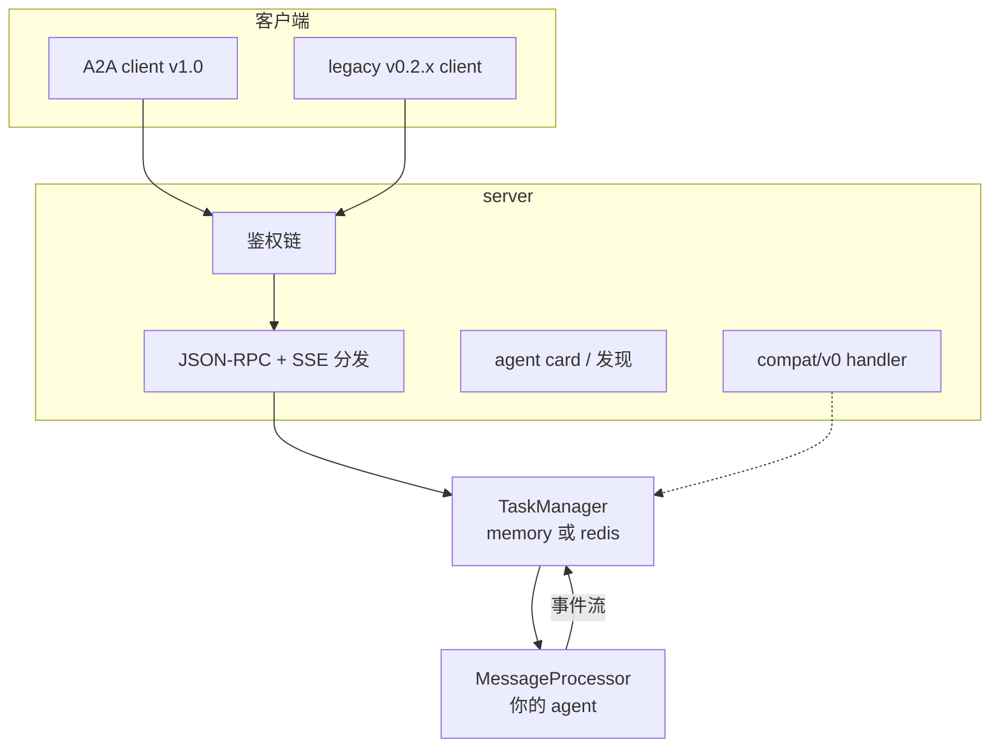
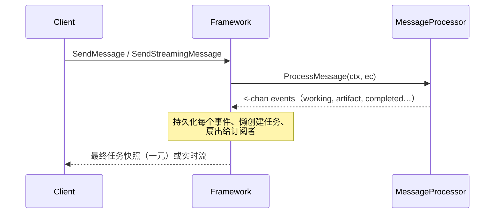

# 框架概览

tRPC-A2A-Go 是 A2A（Agent-to-Agent）协议 v1.0 的 Go 实现。它提供 A2A 对话的
两端：

- 一个 **server**，把你的 agent 经 JSON-RPC（HTTP POST）与 SSE 流式暴露给任意
  A2A 客户端；
- 一个 **client**，以同样的方式调用其他 agent。

两者之间是一切有状态的东西——任务生命周期、流式、会话历史、鉴权、推送通知、
多租户托管——所以你唯一要写的就是 agent 的逻辑。

## 架构



三层，各司其职：

- **server** 终结 wire 层：鉴权、agent card 发现、JSON-RPC 分发与 SSE 流式，
  以及（可选地）在同一端口、同一鉴权链上提供 legacy v0.2.x 端点。
- **TaskManager** 拥有一切有状态的东西：懒创建、轮次 close 规则、取消、会话历
  史、留存、订阅者扇出。内置 memory 与 Redis 两种后端；接口足够小，你也可以自
  己实现。
- **MessageProcessor** 是你唯一要写的部分：读一份请求快照（`ExecContext`），
  往 channel 上发事件。这就是你的 agent。

## 核心思想：一份 processor，一条事件流

v1.0 设计的核心是：你的 agent 就是一个方法：

```go
type MessageProcessor interface {
    ProcessMessage(ctx context.Context, ec *ExecContext) (<-chan protocol.StreamEvent, error)
}
```

你读入请求，返回一个**事件** channel——任务的事件日志。你从不判断"这是不是流式
请求"：框架用*同一份* processor 代码服务 `SendMessage`（一元）与
`SendStreamingMessage`（SSE），从你的事件里派生出阻塞响应或实时流。而且是框架
——不是你——创建并持久化任务、应用生命周期规则、把事件扇出给订阅者。



这取代了 v0.x 的设计——那时 processor 既要返回多种结果形状之一，又要经回调
handle 驱动任务，两条写路径各做一半的工作。从 v0.x 过来的读者见
[从 v0.x 迁移](migration.md)。

## 写 agent —— 两种风格

两者产出同一条事件流；按喜好和你要移植的东西来选。

- **`TaskHandle`**——熟悉的动词 API（`UpdateTaskState`、`AddArtifact`、
  `Reply`）。同步函数体原样可用。这是推荐的默认风格，也是 v0.x processor 迁入
  的形态。参照：
  [examples/basic](https://github.com/trpc-group/trpc-a2a-go/tree/v2/examples/basic)。
- **裸 channel**——自己构造 `protocol.StreamEvent` 并发送。对每个字段完全可控
  （artifact-append 分块就需要它）。参照：
  [examples/simple](https://github.com/trpc-group/trpc-a2a-go/tree/v2/examples/simple)。

```go
func (p *proc) ProcessMessage(ctx context.Context, ec *taskmanager.ExecContext) (<-chan protocol.StreamEvent, error) {
    h := taskmanager.NewTaskHandle(ctx, ec)
    defer h.Close()
    h.UpdateTaskState(protocol.TaskStateWorking, nil)
    result := doWork(ec.Message)
    h.AddArtifact(result.Artifact, true)
    h.UpdateTaskState(protocol.TaskStateCompleted, taskmanager.ReplyText("done"))
    return h.Events(), nil
}
```

## 功能亮点

- A2A **v1.0** wire 协议：sealed `Task | Message` 结果 union、agent card、多传
  输 interface、租户。
- **一份 processor，全部消费模式**：阻塞 send、`returnImmediately`、实时流式、
  `SubscribeToTask` 重连。
- **鉴权**：JWT / API key / OAuth2，provider 可链式组合。
- **推送通知** JWT 签名，公钥经 JWKS 端点分发——用于离线、webhook 驱动的运行。
- **多租户托管**：一个进程、多个 agent、按租户的 agent card。
- **可插拔存储**：内置 memory 与 Redis 后端。
- **legacy 兼容**：v0.2.x 客户端经 `compat/v0` 原样接入，老 wire 默认值保留。

## 下一步去哪

- [协议](protocol.md)——学习 A2A 本身：agent card、四个 wire 对象、任务状态
  机、交互流程。
- [框架行为](behavior.md)——processor 契约、轮次生命周期、取消、历史/留存语义。
- [使用指南](usage.md)——构建配方，每条链接一个可运行示例。
