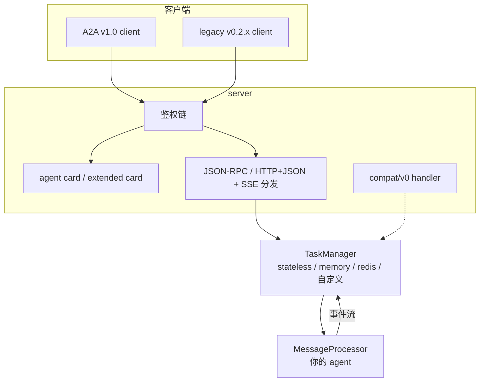
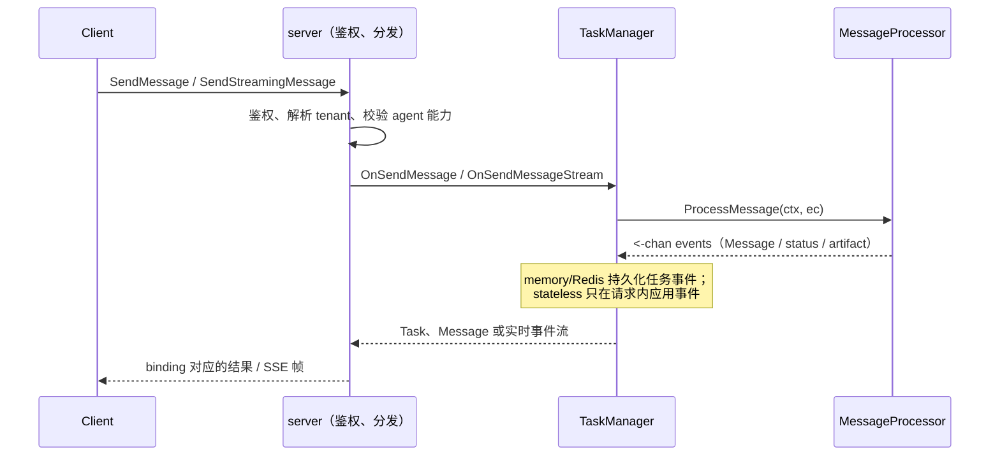

# 框架概览

tRPC-A2A-Go 是 A2A（Agent-to-Agent）协议 v1.0 的 Go 实现。它同时提供两端能力：用 **server** 把你的 agent 暴露为标准 A2A 服务，用 **client** 调用其他 A2A agent。框架处理协议对象、SSE、鉴权、多租户和 v0 兼容层；状态既可交给 memory / Redis 管理，也可只在单次请求内使用而不做任何留存。

如果你还不熟悉 A2A，先看 [协议](protocol.md)。如果已经知道要写服务端或客户端，可以直接看 [服务端](server.md) 与 [客户端](client.md)。

## 适合什么场景

- **把已有 Go agent 接入 A2A 生态**：定义 agent card，实现一个 `MessageProcessor`，框架负责 JSON-RPC、HTTP+JSON 与 SSE。
- **调用远端 agent**：发现 agent card 后，用同一个 client 支持阻塞调用、立即返回、实时流式和断线后订阅。
- **长任务与多轮任务**：任务可查询、可取消、可恢复；`input-required` / `auth-required` 用于等待用户补充。
- **生产化托管**：内置 memory / Redis 存储、JWT / API key / OAuth2、webhook 推送、多租户、子路径部署和 OpenTelemetry 指标。
- **平滑迁移 v0.x**：服务端代码迁移到 v1.0，老 v0.2.x 客户端可继续通过 `compat/v0` 接入。

## 能力矩阵

| 能力 | 状态 | 说明 |
| --- | --- | --- |
| A2A v1.0 协议对象与任务生命周期 | 支持 | `Message`、`Task`、状态事件、artifact 事件和 `Task \| Message` 结果 union。 |
| JSON-RPC 传输绑定 | 支持 | 使用 `application/json` 与 JSON-RPC envelope；流式响应使用 SSE。 |
| HTTP+JSON（REST）传输绑定 | 支持 | 使用 REST 路由、`application/a2a+json`、直接 JSON 响应与 raw SSE data。 |
| gRPC 传输绑定 | 规划中 | A2A v1.0 spec 已定义，当前尚未实现。 |
| 一份 processor 服务一元与流式 | 支持 | 同一个 `ProcessMessage` 同时服务 `SendMessage` 与 `SendStreamingMessage`。 |
| 四种消费模式 | 支持 | 阻塞 send、`returnImmediately`、实时流式、`SubscribeToTask` / Go `ResubscribeTask`。 |
| Stateless 请求内执行 | 支持 | 可返回直接 Message 或临时 Task，不保存任何状态或会话历史。 |
| agent card 发现与扩展 card | 支持 | 公开 card、鉴权后的 extended card、v1/v0 双格式归一化。 |
| 任务管理 | 支持 | `GetTask`、`ListTasks`、`CancelTask`，Go client 暴露为 `GetTasks`、`ListTasks`、`CancelTasks`。 |
| 内存与 Redis 任务存储 | 支持 | 可插拔 `TaskManager` 接口；可自带实现。 |
| 鉴权 | 支持 | JWT、API key、OAuth2，可链式组合，服务端与客户端两侧都有封装。 |
| 推送通知 | 支持 | webhook 配置 CRUD、JWT 签名、JWKS 公钥发布。 |
| 多租户托管 | 支持 | 一个进程承载多个 agent，按请求里的 `tenant` 路由并提供租户 card。 |
| 子路径部署 | 支持 | `WithBasePath` 适配网关或统一前缀。 |
| legacy v0.2.x wire 兼容 | 支持 | `compat/v0` 挂到同一端点、同一鉴权链，保留 v0 默认行为。 |
| OpenTelemetry 指标 | 支持 | 请求数、耗时、TTFT；可注入 meter provider 或让 server 创建 OTLP provider。 |
| Redis 跨节点 `SubscribeToTask` | 支持 | Redis TaskManager 默认记录 Task 事件；要求 Redis 5.0+。 |

## 架构

三层职责是固定的：

- **`server`** 终结 wire 层：鉴权、提供 agent card、分发 JSON-RPC 与 HTTP+JSON 操作和 SSE 流，也可以把 `compat/v0` 挂在同一端点里。
- **`TaskManager`** 决定执行策略，并按需持有状态：stateless 在请求内派生直接 Message 或临时 Task，不留存状态；memory 与 Redis 负责持久化事件、维护会话历史、取消、留存和订阅者扇出。
- **`MessageProcessor`** 是你的 agent：它读取一份只读的 `ExecContext`，返回一个事件 channel。

## 请求生命周期

一元请求和流式请求走同一条流水线：

核心思想只有一句：**agent 发事件，框架从事件流派生所有响应形状。**你的代码不需要判断这次是同步还是流式；`SendMessage` 默认等到终态或挂起态再返回，`SendStreamingMessage` 实时转发同一批事件。推荐先用 `TaskHandle` 写同步风格，确实需要控制底层事件字段时再返回裸 channel。

## 框架帮你处理的细节

- **结果派生**：`SendMessage` 返回最终 `Task` 或直接 `Message`，`SendStreamingMessage` 返回实时事件。
- **任务生命周期**：首个任务事件会创建 Task。memory 与 Redis 将其持久化；stateless 只构造请求内 Task，并在请求结束后丢弃。
- **会话历史**：memory 与 Redis 会保存请求消息、processor 发出的 `Message` 事件，以及被后续状态或 follow-up 取代的上一条 status message；stateless 不保存会话历史。
- **agent card 归一化**：同一张 card 同时包含 v1.0 字段和 v0.x 镜像字段，便于两代客户端读取。
- **兼容层翻译**：`compat/v0` 把 v0.2.x 的斜杠方法名映射到同一个 `TaskManager`。
- **生产能力封装**：鉴权、CORS、子路径、JWKS、push notification、遥测和多租户都通过 server option 接入。

## 当前边界

- 当前实现 JSON-RPC 与 HTTP+JSON（REST）传输绑定；gRPC 尚未落地。
- Redis 后端默认把 Task 事件写入 Redis Stream，使 `SubscribeToTask` 能跨节点接回；continuation、live cancel 和执行 single-writer 仍是节点本地能力，并非分布式工作队列。
- A2A 没有定义“删除任务”API；生产环境需要通过 TTL 控制终态任务留存。

## 下一步

- 新用户先看 [协议](protocol.md)，建立 `Message`、`Task`、事件和状态机的心智模型。
- 写 agent 看 [服务端](server.md)，重点读 `MessageProcessor`、轮次生命周期和 TaskManager 实现。
- 调 agent 看 [客户端](client.md)，重点读发现、四种消费模式和任务管理。
- 从 v0.x 升级看 [从 v0.x 迁移](migration.md)，按清单逐项改。
