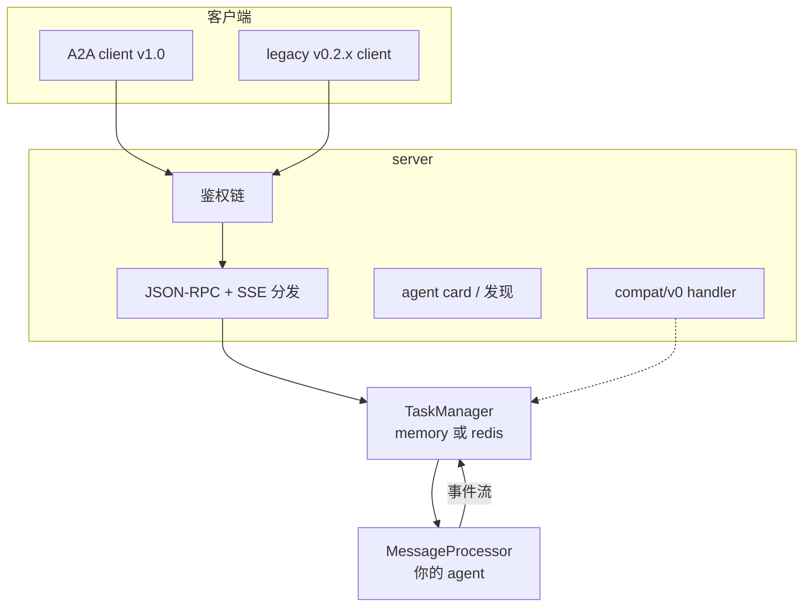
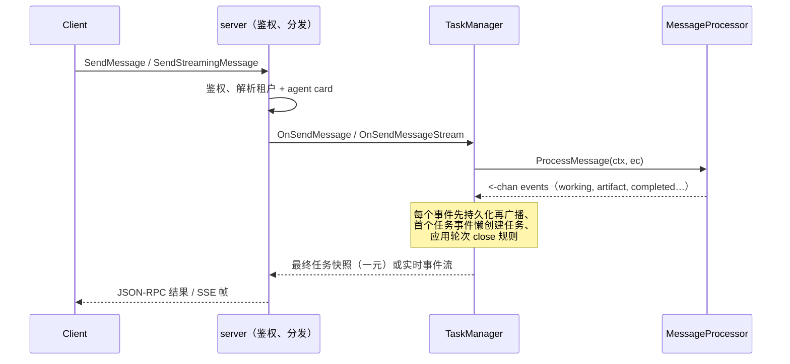

# 框架概览

tRPC-A2A-Go 是 A2A（Agent-to-Agent）协议 v1.0 的 Go 实现。它提供 A2A 对话的两
端——把你的 agent 暴露出去的 **server**，和调用其他 agent 的 **client**——并接
管两者之间一切有状态的东西（任务生命周期、流式、会话历史、鉴权、推送通知、多租
户托管），所以你唯一要写的就是 agent 的逻辑。

## 你能得到什么

| 能力 | 状态 | 说明 |
| --- | --- | --- |
| A2A v1.0 协议对象、任务生命周期、`Task \| Message` 结果 union | ✅ | spec 完整的对象与状态模型。 |
| JSON-RPC 传输绑定（HTTP POST + SSE） | ✅ | 本框架当前服务的 wire。 |
| gRPC / HTTP+JSON（REST）传输绑定 | 🗺️ 规划中 | spec 已定义；尚未实现——目前只有 JSON-RPC。 |
| 一份 processor 服务 `SendMessage` / `SendStreamingMessage` | ✅ | 一条代码路径服务一元与流式。 |
| 阻塞 send、`returnImmediately`、实时流式、`SubscribeToTask` | ✅ | 同一 agent 的四种客户端消费模式。 |
| 内存 & Redis 任务存储 | ✅ | 可插拔 `TaskManager` 接口；可自带。 |
| 鉴权：JWT · API key · OAuth2 | ✅ | 可链式 provider，服务端与客户端两侧。 |
| 推送通知（webhook），JWT + JWKS 签名 | ✅ | 用于离线、回调驱动的运行。 |
| 多租户托管，按租户 agent card | ✅ | 一个进程、多个 agent，按租户路由。 |
| legacy v0.2.x wire 兼容 | ✅ | `compat/v0`，同端点、同鉴权链。 |
| 遥测：OpenTelemetry 指标、TTFT 追踪 | ✅ | 可插拔 meter provider 与首 token 策略。 |
| Redis 后端的跨副本流式 | 🚧 部分 | 快照共享；实时事件扇出是进程内的（见 [behavior.md](behavior.md)）。 |

## 架构



三层，各司其职：

- **`server`** 终结 wire 层。它鉴权、提供 agent card 供发现、分发 JSON-RPC 方法
  与 SSE 流，并（可选地）在同一端口、同一鉴权链内挂载 legacy v0.2.x 端点。经函
  数式 option 配置（`server.WithAgentCard`、`WithAuthProvider`、
  `WithJWKSEndpoint`、`WithBasePath`、`WithCompatHandler`、`WithMiddleware`
  …）。
- **`TaskManager`** 拥有一切有状态的东西：懒创建、轮次 close 规则、取消、会话历
  史、留存、订阅者扇出。`taskmanager` 包定义接口（`OnSendMessage`、
  `OnSendMessageStream`、`OnGetTask`、`OnListTasks`、`OnCancelTask`、
  `OnResubscribe`，以及一组 `OnPushNotification*`）；`taskmanager/memory` 与
  `taskmanager/redis` 实现它，你也可以自带。
- **`MessageProcessor`** 是你唯一要写的部分。它读一份只读的请求快照
  （`ExecContext`），返回一个事件 channel。这就是你的 agent。

## 请求生命周期

每个请求——一元或流式——都走同一条流水线：



核心思想：**你的 agent 就是一个发出事件流的方法，框架从中派生每一种响应形状。**
你的代码里没有流式/非流式分支；`SendMessage` 阻塞并返回终态快照，
`SendStreamingMessage` 实时转发事件，两者都出自同一个 `ProcessMessage`。

## 框架如何处理协议

框架的很大一部分,是那些你不必自己做的协议工作:

- **结果派生**——`SendMessage` 根据你的 processor 发了什么,返回 `Task` 或
  `Message`(sealed union),阻塞到该轮结束;`returnImmediately` 以首个可用结果
  应答、工作继续。你只管发事件。
- **懒创建与持久化**——任务在首个任务事件时成立,每个事件先持久化再广播,所以
  `GetTask` 永不落后于订阅者所见。
- **agent card 归一化**——card 同时带 v1.0 字段(`supportedInterfaces`、
  `securitySchemes`)与其 v0.2.x 弃用镜像,所以一张 card 两代客户端都能读。
- **流生命周期**——resubscribe 的 SSE 流以当前任务快照开头、在终态/中断态结束、
  client 断连时被排空而不取消已分离的工作。
- **legacy 翻译**——`compat/v0` 把 v0.2.x 斜杠方法 wire 映射到同一个
  `TaskManager`,保留老默认(尤其非阻塞的 `message/send`)。

确切的契约——轮次生命周期、取消、历史与留存语义,以及在 spec 之上属于有意选择
的部分——见 [behavior.md](behavior.md)。

## 写 agent —— 两种风格

两者产出同一条事件流;按喜好和你要移植的东西来选。

- **`TaskHandle`**——熟悉的动词 API(`UpdateTaskState`、`AddArtifact`、
  `Reply`)。同步函数体原样可用。推荐的默认风格,也是 v0.x processor 迁入的形态。
  → [examples/basic](https://github.com/trpc-group/trpc-a2a-go/tree/v2/examples/basic)
- **裸 channel**——自己构造 `protocol.StreamEvent` 并发送。对每个字段完全可控
  (artifact-append 分块就需要它)。
  → [examples/simple](https://github.com/trpc-group/trpc-a2a-go/tree/v2/examples/simple)

```go
func (p *proc) ProcessMessage(ctx context.Context, ec *taskmanager.ExecContext) (<-chan protocol.StreamEvent, error) {
    h := taskmanager.NewTaskHandle(ctx, ec)
    defer h.Close()
    h.UpdateTaskState(protocol.TaskStateWorking, nil)
    result := doWork(ec.Message)
    h.AddArtifact(result.Artifact, true)
    h.UpdateTaskState(protocol.TaskStateCompleted, taskmanager.ReplyText("done"))
    return h.Events(), nil
}
```

## 路线图

- **gRPC 与 HTTP+JSON（REST）传输绑定**——spec 定义了三种;本框架目前服务
  JSON-RPC 绑定,agent card 已经建模了多传输声明,以备另外两种落地。
- **Redis 跨副本流式**——实时事件扇出目前是进程内的;共享 pub/sub 桥是通向完整
  多副本流式的规划路径。

## 下一步去哪

- [协议](protocol.md)——学习 A2A 本身:agent card、四个 wire 对象、任务状态机、
  交互流程。
- [框架行为](behavior.md)——processor 契约、轮次生命周期、取消、历史/留存语义。
- [使用指南](usage.md)——覆盖每项能力的构建配方,每条链接一个可运行示例。
- [从 v0.x 迁移](migration.md)——移植既有 v0.x agent。
