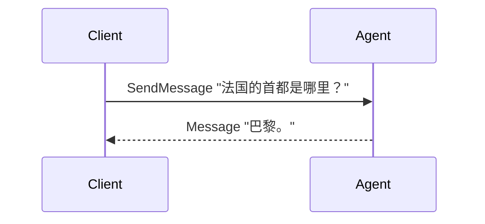
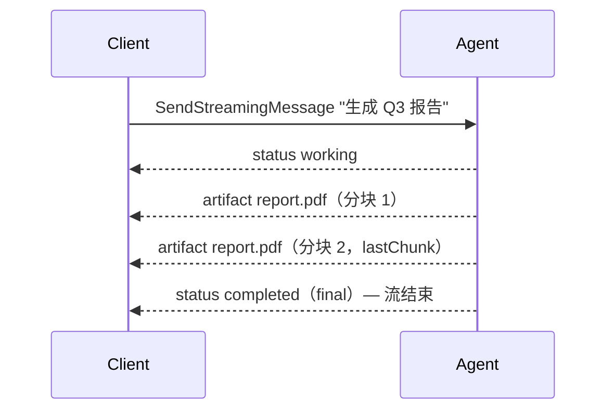
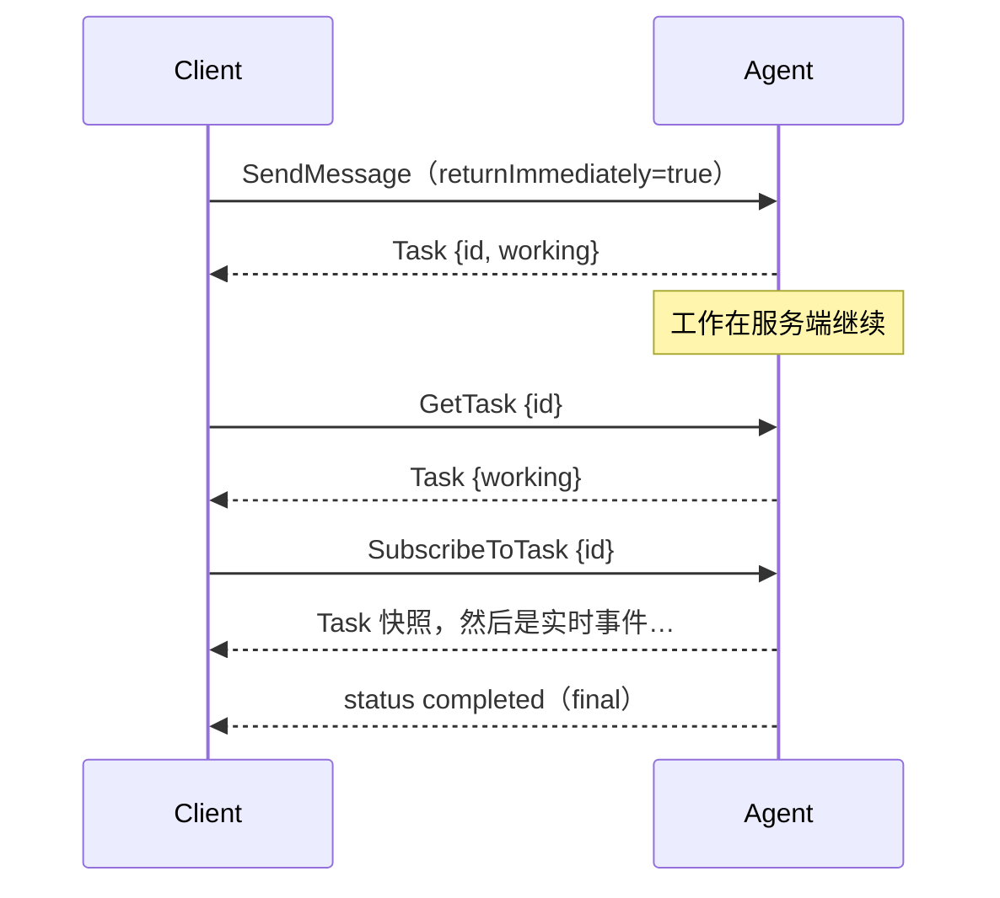
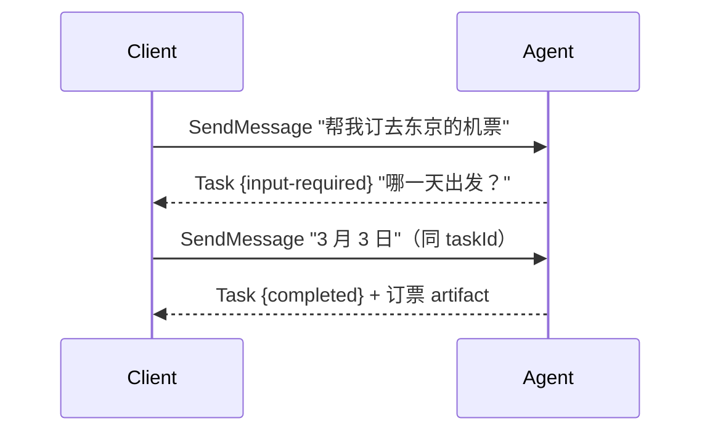
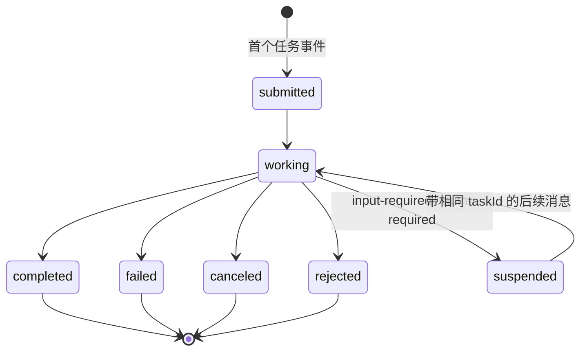

# 理解 A2A 协议

本页从使用者的视角讲 A2A：它解决什么问题、心智模型是什么、你和一个 agent 之间
实际会发生哪些交互——然后才是正式的对象与 RPC 定义。本框架如何实现这套协议见
[behavior.md](behavior.md)。

## A2A 解决什么问题？

AI agent 正在变成服务：报告生成器、差旅预订助手、代码评审员——各自出自不同团
队、不同框架、不同语言，甚至不同组织。A2A（Agent-to-Agent）就是让任意 client
无需了解 agent 怎么实现就能与之对话的开放协议。典型场景：

- **产品后端**调用一个远端 agent 拿答案；
- **长时任务**（生成报告、处理数据集）：流式进度、断线不丢、随时接回；
- **表单式交互**：agent 需要追问补充信息才能继续；
- **编排 agent** 把工作分发给多个专家 agent；
- **跨组织调用**：需要鉴权与 webhook 回调。

传输层刻意保持朴素：client 先取 agent 的 **agent card**
（`/.well-known/agent-card.json`）了解其身份、技能与能力，然后走 JSON-RPC
——一元调用基于 HTTP POST，流式基于 SSE。trpc-a2a-go 实现 A2A **v1.0**
（legacy v0.2.x wire 由 [compat/v0](https://github.com/trpc-group/trpc-a2a-go/tree/v2/compat/v0) 层继续支持）。

## 心智模型

A2A 的一切都挂在两个名词上：

- **会话**（`contextId`）——你与 agent 之间持续的交流，可以跨任意多个问题和
  任务；
- **任务**（`taskId`）——会话里一个被跟踪的工作单元，有可观察、可恢复、可取
  消的生命周期。

内容则恰好分两类：

> **Message 是"说话"，Artifact 是"交货"。** 提问、回答、澄清——是
> `Message`；任务产出的报告、代码、数据——是 `Artifact`，挂在任务上。


不是每次交流都会产生任务：一个即答问题就是一条 `Message` 回来——没有生命周
期、没有清理负担。只有值得跟踪的工作 agent 才会开任务；从那之后，agent 汇报
的一切都是**事件**：状态更新（进度）或 artifact 更新（交付物分块）。

## 交互逻辑：一次一个场景

### 1. 即问即答——完全没有任务

最简单的交流：`SendMessage`，agent 用一条纯 Message 应答。无须跟踪，不留痕迹。



### 2. 带实时进度的跟踪任务

同样的请求换到流式端点：每个事件发生的瞬间就到达你这里。首个任务事件就是任务
诞生的时刻。



想一次调用等到底？普通 `SendMessage` 默认就是阻塞的，返回最终任务快照，
artifacts 都在里面。

### 3. 不想等——先拿结果，稍后跟进

设 `returnImmediately=true`，服务端以最早可用的结果应答，工作继续跑。之后用
`GetTask` 轮询，或用 `SubscribeToTask` 接回——它的首帧永远是当前任务快照，
离线期间错过的内容都已被快照吸收。



要完全离线运行，注册 webhook（`CreateTaskPushNotificationConfig`），让服务端
反过来通知你。

### 4. agent 需要你补充信息——多轮交互

无法继续时，agent 把任务停在 `input-required`（或 `auth-required`）并向你提
问。你**带相同的 `taskId`** 发消息来恢复——这是多轮交互唯一的规则。不带
`taskId` 的后续消息会开一个全新任务，把旧任务永远晾在那里。



### 5. 改主意了——取消

`CancelTask` 请求 agent 停手。响应是请求时刻的任务快照（往往还是
`working`）；终态 `CANCELED` 在 agent 收尾时落定。已结束的任务不可取消
（`-32002`）。


---

## 协议定义参考

上述场景背后的正式定义。

### 四个 wire 对象

| 对象 | 角色 | 一句话 |
| --- | --- | --- |
| **Message** | **沟通** | 一轮对话：`role`（user/agent）、`parts`（text/file/data）、`messageId`，可选 `taskId`/`contextId`。 |
| **Task** | **工作单元** | 有状态的持久记录：`id`、`contextId`、`status`、`artifacts[]`、`history[]`。由服务端创建，终态后不可变。 |
| **TaskStatusUpdateEvent** | **进度** | 宣告一次状态迁移；可挂解释性 `message`；`final=true` 标记该轮最后一帧状态。 |
| **TaskArtifactUpdateEvent** | **交付物** | 承载一个 `Artifact`。分块流式用 `append`（续上一块）与 `lastChunk`。 |

两个标识符把一切串起来：**`contextId`** 命名会话（缺席时服务端生成；一个会话
跨多个任务），**`taskId`** 命名工作单元（回传它可恢复等待中的任务）。由此有
两条 spec 规则：`contextId` 与目标任务不匹配的消息 agent **MUST 拒绝**；消息
可经可选的 `referenceTaskIds` 字段*引用*相关任务而不恢复它们。

### 任务状态机



终态（`completed`/`failed`/`canceled`/`rejected`）**不可变**：终态任务不可再
修改，订阅它会被拒绝。spec 把 `input-required`/`auth-required` 称为
**interrupted（中断）态**——处理暂停、等待 client 行动；wire 枚举里还有一个
`TASK_STATE_UNSPECIFIED` 占位，用于状态不明的情形。

### RPC 面（v1.0）

v1.0 JSON-RPC 绑定定义的方法名如下（v0.2.x wire 用的是斜杠分隔名，列出以供
对照）：

| 方法（v1.0） | 类型 | 用途 | v0.2.x 名称 |
| --- | --- | --- | --- |
| `SendMessage` | 一元 | 发送消息；响应是 **`Task` 或 `Message`**（union）。默认**等待**该轮结束。 | `message/send` |
| `SendStreamingMessage` | SSE | 同样的请求；每个事件实时流出。 | `message/stream` |
| `GetTask` | 一元 | 取任务快照；`historyLength` 决定随附多少历史。 | `tasks/get` |
| `ListTasks` | 一元 | 枚举任务：可按 `contextId`/状态过滤、分页。 | —（v1.0 新增） |
| `CancelTask` | 一元 | 请求取消。 | `tasks/cancel` |
| `SubscribeToTask` | SSE | 接回运行中任务的事件流：先快照，后增量。 | `tasks/resubscribe` |
| `CreateTaskPushNotificationConfig` / `Get…` / `List…` / `Delete…` | 一元 | webhook 配置 CRUD，用于离线运行。 | `tasks/pushNotificationConfig/*` |
| `GetExtendedAgentCard` | 一元 | 鉴权后的扩展 agent card。 | `agent/getAuthenticatedExtendedCard` |

### 阻塞与 `returnImmediately`

`SendMessage` 可带 `configuration.returnImmediately`：

> 若为 `false`（**默认**），操作 MUST 等到任务到达终态（COMPLETED、FAILED、
> CANCELED、REJECTED）或中断态（INPUT_REQUIRED、AUTH_REQUIRED）后再返回。

> **v0.2.x 注**：老 wire 的默认值恰好*相反*——`blocking` 可选且缺席意味着
> "立即应答"。v1.0 把默认翻转了。compat 层为 legacy 客户端保留老默认；主动迁
> 移的客户端必须显式选择（见[迁移指南](https://github.com/trpc-group/trpc-a2a-go/blob/v2/README.md#migrating-from-v0x)）。

### 典型事件范式

产生任务的一轮通常长这样，其中真正强制的部分：

```
status  -> submitted     可选：创建即隐含 submitted
status  -> working       惯例；自然的"已受理"信号
artifact-> chunk 1..N    同一 artifact 的分块用 append/lastChunk
status  -> completed     必须：以合法状态收尾；带 final=true
```

强制项：以合法状态结束（终态，或多轮场景的挂起态）、收尾状态帧带
`final=true`、artifact 分块标志。其余——要不要显式 `submitted`、发几帧
`working`、进度文字挂不挂在 status message 上——都由 agent 自定。
