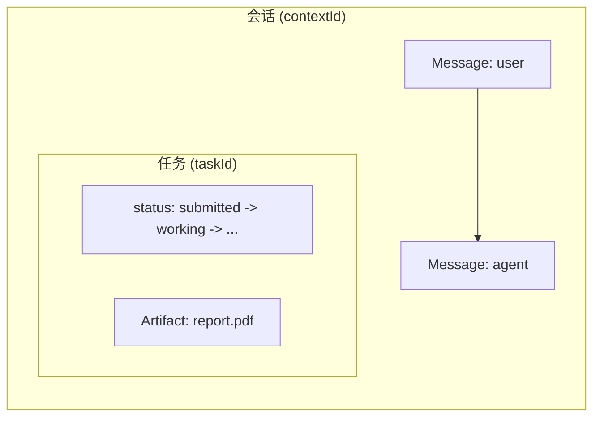
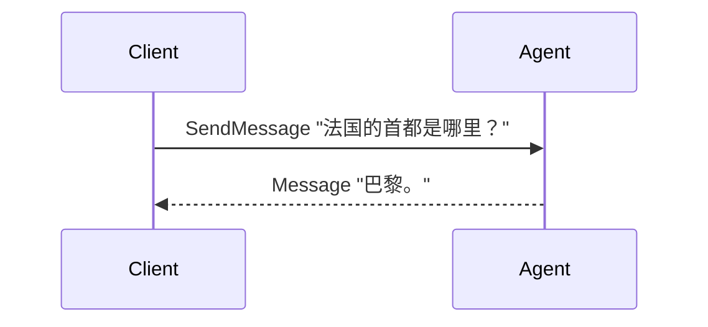
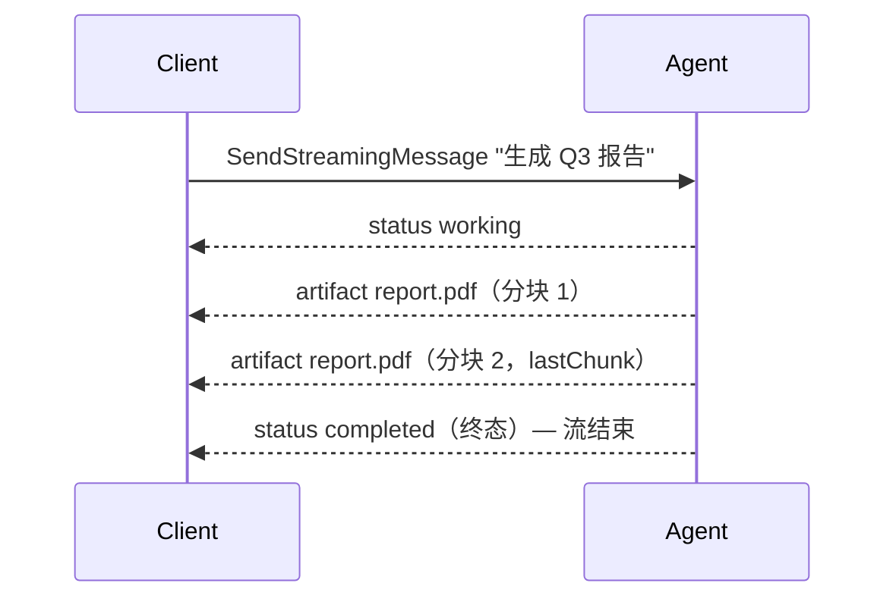
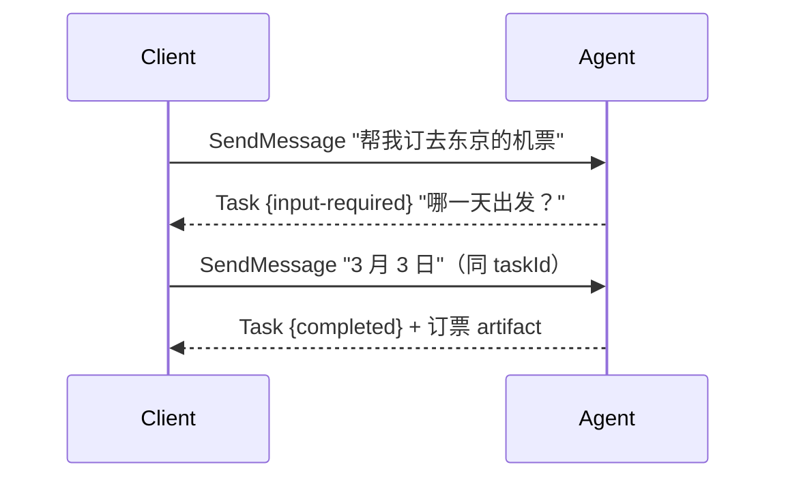
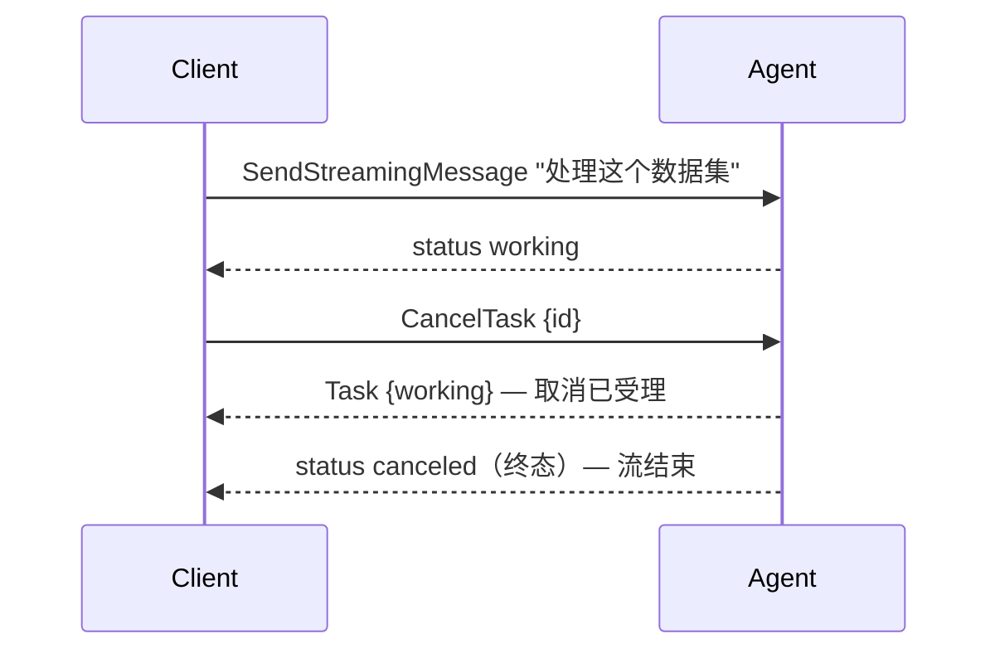
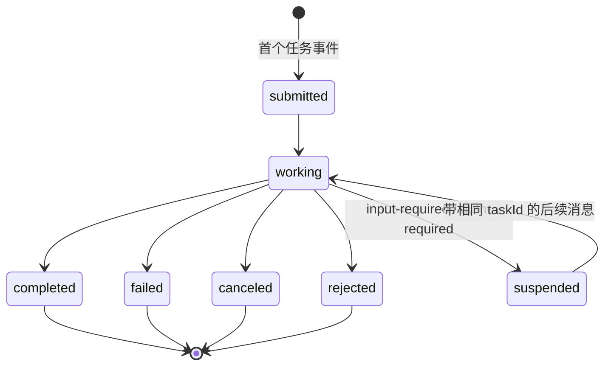

# 理解 A2A 协议

本页从使用者的视角讲 A2A：它解决什么问题、心智模型是什么、如何发现一个 agent、
你和一个 agent 之间实际会发生哪些交互——然后才是正式的对象与 RPC 定义。本框架
如何实现这套协议见 [behavior.md](behavior.md)。

## A2A 解决什么问题？

AI agent 正在变成服务：报告生成器、差旅预订助手、代码评审员——各自出自不同团
队、不同框架、不同语言，甚至不同组织。A2A（Agent-to-Agent）就是让任意 client
无需了解 agent 怎么实现就能与之对话的开放协议。典型场景：

- **产品后端**调用一个远端 agent 拿答案；
- **长时任务**（生成报告、处理数据集）：流式进度、断线不丢、随时接回；
- **表单式交互**：agent 需要追问补充信息才能继续；
- **编排 agent** 把工作分发给多个专家 agent；
- **跨组织调用**：需要鉴权与 webhook 回调。

传输层刻意保持朴素：client 先取 agent 的 **agent card** 了解其身份、技能与能
力，然后走 JSON-RPC——一元调用基于 HTTP POST，流式基于 SSE。trpc-a2a-go 实现
A2A **v1.0**（legacy v0.2.x wire 由
[compat/v0](https://github.com/trpc-group/trpc-a2a-go/tree/v2/compat/v0) 层继续支持）。

## 心智模型

A2A 的一切都挂在两个名词上：

- **会话**（`contextId`）——你与 agent 之间持续的交流，可以跨任意多个问题和
  任务；
- **任务**（`taskId`）——会话里一个被跟踪的工作单元，有可观察、可恢复、可取
  消的生命周期。

内容则恰好分两类：

> **Message 是"说话"，Artifact 是"交货"。** 提问、回答、澄清——是
> `Message`；任务产出的报告、代码、数据——是 `Artifact`，挂在任务上。



不是每次交流都会产生任务：一个即答问题就是一条 `Message` 回来——没有生命周
期、没有清理负担。只有值得跟踪的工作 agent 才会开任务；从那之后，agent 汇报
的一切都是**事件**：状态更新（进度）或 artifact 更新（交付物分块）。

## 发现：Agent Card

在调用一个 agent 之前，client 需要知道它存在、部署在哪、能做什么、如何鉴权。
这就是 **Agent Card**——agent 发布在 well-known 路径上的一份 JSON 文档：

```
GET https://agent.example.com/.well-known/agent-card.json
```

card 是整个协议的入口。client 取一次、得到所需的一切，然后开始交互。主要分区：

| 分区 | 字段 | 告诉 client 什么 |
| --- | --- | --- |
| **身份** | `name`、`description`、`version`、`provider`、`iconUrl`、`documentationUrl` | 这个 agent 是谁。 |
| **传输** | `supportedInterfaces[]`（每项：`url`、`protocolBinding`、`protocolVersion`、可选 `tenant`） | 在哪、以何种方式调用。第一项为首选。 |
| **能力** | `capabilities.streaming`、`.pushNotifications`、`.extendedAgentCard`、`.extensions` | 支持哪些可选特性。 |
| **技能** | `skills[]`（每项：`id`、`name`、`description`、`tags`、`examples`、`inputModes`、`outputModes`） | 实际能做什么，以离散公示的能力表达。 |
| **输入输出模态** | `defaultInputModes`、`defaultOutputModes` | 默认接受与产出的媒体类型（如 `"text"`）。 |
| **安全** | `securitySchemes`、`securityRequirements` | 如何鉴权（API key / HTTP / OAuth2 / OIDC / mTLS）。 |

本框架构造一张最小 card 的样子：

```go
agentCard := server.AgentCard{
    Name:        "Text Reversal Agent",
    Description: "Reverses text input",
    URL:         "http://localhost:8080/",   // 成为一个 supportedInterfaces 项
    Version:     "1.0.0",
    Capabilities: server.AgentCapabilities{
        Streaming: boolPtr(true),
    },
    DefaultInputModes:  []string{"text"},
    DefaultOutputModes: []string{"text"},
    Skills: []server.AgentSkill{{
        ID:          "reverse",
        Name:        "Text Reverser",
        Description: stringPtr("Input: reverse hello → Output: olleh"),
        Tags:        []string{"text"},
    }},
}
```

两个相关概念：

- **扩展 card**——agent 可以在 client **鉴权之后**提供一张更丰富的 card（不想
  公开的技能或细节）。client 用 `GetExtendedAgentCard` 获取；公开 card 用
  `capabilities.extendedAgentCard` 声明这一点。
- **多传输**——`supportedInterfaces` 可列出多个绑定（JSON-RPC、gRPC、REST），
  在本框架里还可按租户列不同 URL；client 选它支持的第一个。
- **扩展（Extensions）**——URI 标识的协议扩展，agent 在 `capabilities.extensions`
  中声明；client 按请求选入，agent 可把某个标为 `required`（未选入则报
  `-32008`）。
- **签名**——card 可以经 JWS 签名（`signatures`），让 client 校验它未被篡改。

## 交互逻辑：一次一个场景

### 1. 即问即答——完全没有任务

最简单的交流：`SendMessage`，agent 用一条纯 Message 应答。无须跟踪，不留痕迹。



### 2. 带实时进度的跟踪任务

同样的请求换到流式端点：每个事件发生的瞬间就到达你这里。首个任务事件就是任务
诞生的时刻。



想一次调用等到底？普通 `SendMessage` 默认就是阻塞的，返回最终任务快照，
artifacts 都在里面。

### 3. 不想等——先拿结果，稍后跟进

设 `returnImmediately=true`，服务端以最早可用的结果应答，工作继续跑。之后用
`GetTask` 轮询，或用 `SubscribeToTask` 接回——它的首帧永远是当前任务快照，
离线期间错过的内容都已被快照吸收。


要完全离线运行，注册 webhook（`CreateTaskPushNotificationConfig`），让服务端
反过来通知你。

### 4. agent 需要你补充信息——多轮交互

无法继续时，agent 把任务停在 `input-required`（或 `auth-required`）并向你提
问。你**带相同的 `taskId`** 发消息来恢复——这是多轮交互唯一的规则。不带
`taskId` 的后续消息会开一个全新任务，把旧任务永远晾在那里。



### 5. 改主意了——取消

`CancelTask` 请求 agent 停手。响应是请求时刻的任务快照（往往还是
`working`）；终态 `CANCELED` 在 agent 收尾时落定。已结束的任务不可取消
（`-32002`）。



---

## 协议定义参考

上述场景背后的正式定义。

### 四个 wire 对象

| 对象 | 角色 | 一句话 |
| --- | --- | --- |
| **Message** | **沟通** | 一轮对话。 |
| **Task** | **工作单元** | 有状态、可观察的记录。 |
| **TaskStatusUpdateEvent** | **进度** | 一次状态迁移的宣告。 |
| **TaskArtifactUpdateEvent** | **交付物** | 一个产出的 artifact（或分块）。 |

**Message**——必填 `messageId`、`role`（user/agent）、`parts`；可选 `taskId`
（定向/续跑任务）、`contextId`（会话）、`referenceTaskIds`（引用相关任务而不
恢复它们）、`extensions`、`metadata`。

**Task**——必填 `id`、`status`；另有 `contextId`、`artifacts[]`、`history[]`
（任务执行期间交换的 messages；不保证每条都被持久化——留存策略由实现自定）、
`metadata`。

**TaskStatusUpdateEvent**——`taskId`、`contextId`、`status`（一个 `TaskStatus`，
携带 `state` 与可选的解释性 `message`）、`metadata`。v1.0 wire 没有显式的
`final` 字段：`state` 为终态（或中断态）的那一帧就是最后一帧，之后 SSE 流关闭。

**TaskArtifactUpdateEvent**——`taskId`、`contextId`、`artifact`，以及两个分块
标志：`append`（本事件续上同一 artifact 的上一块，而非新起一块）与 `lastChunk`
（最后一块）。

两个标识符把一切串起来：**`contextId`** 命名会话（缺席时服务端生成；一个会话
跨多个任务），**`taskId`** 命名工作单元（回传它可恢复等待中的任务）。由此有一条
spec 规则：`contextId` 与目标任务不匹配的消息 agent **MUST 拒绝**。

### Part：message 或 artifact 携带什么

message 和 artifact 都携带一个 **parts** 列表，所以一轮可以混合文本、文件与结
构化数据：

| Part | 携带 | 构造器 |
| --- | --- | --- |
| **Text** | 一个 UTF-8 字符串 | `protocol.NewTextPart(text)` |
| **File** | 按 URL + 文件名 + 媒体类型引用文件（或原始字节） | `protocol.NewFilePart(url, name, mediaType)` / `NewRawPart(bytes, mediaType)` |
| **Data** | 任意结构化 JSON | `protocol.NewDataPart(value)` |

agent card 上的 `defaultInputModes` / `defaultOutputModes`，以及请求上的
`acceptedOutputModes`，协商流动哪些媒体类型。输出协商是建议性的；不支持的
*输入*内容类型则是硬错误（`-32005`）。

### 任务状态机



| 状态（wire 枚举） | 类别 | 含义 |
| --- | --- | --- |
| `TASK_STATE_SUBMITTED` | 活跃 | 已受理，尚未开始 |
| `TASK_STATE_WORKING` | 活跃 | 正在处理 |
| `TASK_STATE_INPUT_REQUIRED` | 中断 | 需要 client 补充输入 |
| `TASK_STATE_AUTH_REQUIRED` | 中断 | 需要鉴权才能继续 |
| `TASK_STATE_COMPLETED` | 终态 | 成功完成 |
| `TASK_STATE_FAILED` | 终态 | 出错结束 |
| `TASK_STATE_CANCELED` | 终态 | 完成前被取消 |
| `TASK_STATE_REJECTED` | 终态 | agent 拒绝了该任务 |
| `TASK_STATE_UNSPECIFIED` | — | 状态不明的占位 |

**终态**不可变：终态任务不可再修改，订阅它会被拒绝。**中断**态暂停处理、等待
client 行动（一条后续消息，或鉴权）。

### RPC 面（v1.0）

v1.0 JSON-RPC 绑定定义的方法名如下（v0.2.x wire 用的是斜杠分隔名，列出以供
对照）：

| 方法（v1.0） | 类型 | 用途 | v0.2.x 名称 |
| --- | --- | --- | --- |
| `SendMessage` | 一元 | 发送消息；响应是 **`Task` 或 `Message`**（union）。默认**等待**该轮结束。 | `message/send` |
| `SendStreamingMessage` | SSE | 同样的请求；每个事件实时流出。 | `message/stream` |
| `GetTask` | 一元 | 取任务快照；`historyLength` 决定随附多少历史。 | `tasks/get` |
| `ListTasks` | 一元 | 枚举任务：可按 `contextId`/状态过滤、分页。 | —（v1.0 新增） |
| `CancelTask` | 一元 | 请求取消。 | `tasks/cancel` |
| `SubscribeToTask` | SSE | 接回运行中任务的事件流：先快照，后增量。 | `tasks/resubscribe` |
| `CreateTaskPushNotificationConfig` / `Get…` / `List…` / `Delete…` | 一元 | webhook 配置 CRUD，用于离线运行。 | `tasks/pushNotificationConfig/*` |
| `GetExtendedAgentCard` | 一元 | 鉴权后的扩展 agent card。 | `agent/getAuthenticatedExtendedCard` |

v1.0 spec 定义了三种功能等价的传输绑定——JSON-RPC、gRPC、HTTP+JSON/REST——各自
有绑定特定的方法命名。本框架实现 JSON-RPC 绑定（上表方法名）；agent card 的
`supportedInterfaces` 声明一个 agent 提供哪些绑定。

### 阻塞与 `returnImmediately`

`SendMessage` 可带 `configuration.returnImmediately`：

> 若为 `false`（**默认**），操作 MUST 等到任务到达终态（COMPLETED、FAILED、
> CANCELED、REJECTED）或中断态（INPUT_REQUIRED、AUTH_REQUIRED）后再返回。

> **v0.2.x 注**：老 wire 的默认值恰好*相反*——`blocking` 可选且缺席意味着
> "立即应答"。v1.0 把默认翻转了。compat 层为 legacy 客户端保留老默认；主动迁
> 移的客户端必须显式选择（见[从 v0.x 迁移](migration.md)）。

### 错误码

标准 JSON-RPC 码适用（`-32700` 解析错误、`-32600` 无效请求、`-32601` 方法不存
在、`-32602` 参数无效、`-32603` 内部错误），另加 A2A 专用区间：

| 码 | 含义 |
| --- | --- |
| `-32001` | 任务未找到 |
| `-32002` | 任务不可取消（已终态） |
| `-32003` | 不支持推送通知 |
| `-32004` | 不支持该操作 |
| `-32005` | 内容类型不兼容 |
| `-32006` | agent 响应无效 |
| `-32007` | 未配置扩展 agent card |
| `-32008` | client 未选入某个必需的 extension |
| `-32009` | 请求的 A2A 协议版本不受支持 |

### 典型事件范式

产生任务的一轮通常长这样，其中真正强制的部分：

```
status  -> submitted     可选：创建即隐含 submitted
status  -> working       惯例；自然的"已受理"信号
artifact-> chunk 1..N    同一 artifact 的分块用 append/lastChunk
status  -> completed     必须：以合法状态收尾；终态即关闭流
```

强制项：以合法状态结束（终态，或多轮场景的挂起态）并标注 artifact 分块；终态
（或中断态）的那一帧即流的最后一帧，之后 SSE 流关闭。其余——要不要显式
`submitted`、发几帧 `working`、进度文字挂不挂在 status message 上——都由 agent
自定。

下一步：[框架行为](behavior.md) 讲本框架如何把这条事件流变成持久化任务与派生
响应；[服务端](server.md) 展示如何在代码里发出它。
