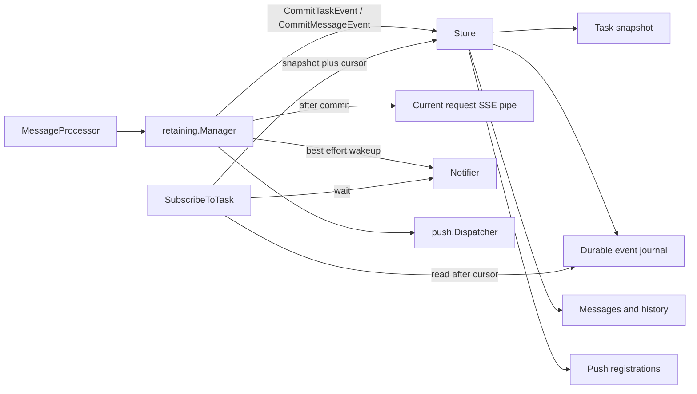

# 通用 Retaining TaskManager、Store 与跨节点事件同步设计

状态：Draft

设计基线：`origin/v2@aed2c1f02f9cb43e8d7eb9bd62f51585fbd2030a`

## 设计摘要

- 新增公共 `taskmanager/retaining`，只维护一套 retaining 生命周期 engine。
- 首版只公开一个 Store 和一个可选 Notifier，避免过早拆出大量小接口。
- Store 是持久化真相，Task 快照和对应 Task Event 必须原子提交；Notifier 只做可丢失唤醒。
- Memory、Redis 保持原构造函数和 options，通过 wrapper 接入通用 Manager；MySQL 使用独立 module。
- 首版跨节点能力覆盖状态可见性、事件同步和 `SubscribeToTask`（TaskManager 接口方法仍为 `OnResubscribe`），不覆盖 execution 调度、continuation 路由或远端 live cancel。
- 实施顺序固定为契约测试、Memory、Redis、MySQL，避免一个 PR 同时改动三个后端。

## 1. 背景

当前 `taskmanager/memory` 与 `taskmanager/redis` 都实现了完整的 retaining TaskManager 生命周期，包括 Task lazy creation、事件归约、conversation history、continuation、cancel、suspend/yield、`returnImmediately`、SSE、本地执行注册、Push Notification 和关闭流程，但两套实现分别维护了一套 engine、持久化和订阅逻辑。

Memory 在进程内锁保护下直接修改共享 Task；Redis 使用 execution-local Task 副本，并在事件广播前将 Task 快照和 Redis Stream 事件持久化。Redis 的 `taskEventTransport` 已经形成了一个局部抽象，但它位于 Redis 模块内部，无法直接支持 MySQL 或其他后端。

为了新增 MySQL TaskManager，同时避免继续复制完整生命周期，本设计提取一个通用 retaining TaskManager，由 Store 提供持久化真相和可靠事件日志，由可选 Notifier 提供跨节点低延迟唤醒。

## 2. 目标

- Memory、Redis、MySQL 使用同一套 Task 生命周期 engine。
- 保持现有 `taskmanager.TaskManager` 接口以及 Memory/Redis 构造函数和 options 的兼容性。
- Store 同时支持聚合 Task 快照、conversation history、Push 配置、Task 事件日志、版本控制和留存策略。
- Task 快照更新与产生该快照的 Task 事件必须原子提交。
- `SubscribeToTask` 可以在任意共享 Store 的节点上先得到一致的当前 Task 快照，再持续读取后续事件。
- 跨节点通知允许丢失或重复；订阅建立后的无缝读取由持久化事件日志、cursor 和有界轮询共同保证。
- tenant 与 owner 共同构成所有留存状态的隔离边界。
- 后端可以使用不同的事务、TTL、索引和通知机制，不要求模拟同一种物理存储模型。

## 3. 非目标

- 不在本阶段实现 active execution 的跨节点迁移或调度。
- 不在本阶段将 continuation 路由到原执行节点。
- 不在本阶段将 live cancel 信号发送到其他节点上的 Processor。
- 不提供 exactly-once webhook 投递；自动 Push 继续使用现有进程内有界 Dispatcher，durable outbox 仍由业务在手动投递模式下实现。
- 不新增 A2A 协议未定义的按 Task 删除 API。
- 不要求所有后端采用相同的默认 TTL；现有 Memory 和 Redis 默认值保持不变。
- 不在首个实现中把 Store 再拆成大量公共 CRUD 接口。

## 4. 核心设计原则

### 4.1 事件日志是跨节点同步的可靠来源

Notifier 只负责唤醒等待者，可能丢失、重复或产生伪唤醒。订阅者被唤醒后必须使用 cursor 从 Store 读取事件；即使完全没有 Notifier，也能通过退避轮询正确工作。

### 4.2 Task 快照与 Task 事件共享提交边界

Status 和 Artifact 事件既会修改聚合 Task 快照，也需要进入事件日志。Store 必须通过单个 `CommitTaskEvent` 操作原子提交二者，禁止在通用 Manager 中先 `UpdateTask` 再 `AppendEvent`。

### 4.3 先持久化，后对外可见

Task 事件只有在 Store 提交成功后才能进入当前请求的 SSE pipe、Push Dispatcher 或本地订阅者。Notifier 在提交后调用，Notifier 失败不回滚已经提交的 Task/Event。

### 4.4 CAS 是跨节点写冲突的最后保护

进程内 execution registry 只能阻止同一进程中的并发轮次。Store 必须保存 Task version，并使用 `expectedVersion` 拒绝跨节点陈旧写入。CAS 可以防止数据被覆盖，但不会撤销 Processor 已经产生的外部副作用，因此它不是分布式执行锁的替代品。

### 4.5 Conversation history 是独立投影

Task 快照与 Task 事件要求强原子性；conversation history 跨 Task、Message 和 Redis Cluster slot，不能对所有后端承诺与 Task/Event 的全局原子事务。Message 写入必须幂等，Store 操作必须支持安全重试；Task/Event 是任务观察面的主真相，history 是独立投影。

### 4.6 Store 边界不共享可变对象

`protocol.Task`、`protocol.Message` 和 `protocol.StreamResponse` 都包含指针、slice 或 map。Store 的所有读操作必须返回深拷贝，所有写操作必须在返回前复制输入；调用方在 Store 方法返回后继续修改原对象，不得改变已经提交的状态。该规则对 Memory、Redis 和 MySQL 完全一致，是 Memory 不绕过 version/CAS 和 Task/Event 原子边界的必要条件。

## 5. 总体架构



通用 Manager 保留协议和生命周期语义；Store 负责持久化、原子性、查询和留存；Notifier 只提供跨节点唤醒。当前请求的 SSE 不回读事件日志，而是在提交成功后直接发送原事件，避免增加正常流式路径的存储读取延迟。

## 6. 包结构

```text
taskmanager/
├── interface.go
├── retaining/
│   ├── manager.go
│   ├── engine.go
│   ├── execution_registry.go
│   ├── store.go
│   ├── notifier.go
│   ├── subscriber.go
│   └── options.go
├── memory/
│   ├── memory.go
│   ├── store.go
│   └── options.go
└── taskmanagertest/
    └── retaining_suite.go

taskmanager/redis/                  # 独立 Go module，路径保持不变
├── redis.go
├── store.go
└── options.go

taskmanager/mysql/                  # 新独立 Go module
├── mysql.go
├── store.go
├── options.go
├── schema.sql
└── go.mod
```

`taskmanager/retaining` 必须位于根模块的公共导入路径下，因为 Redis 与 MySQL 是独立 Go module，无法导入根模块的 `internal` 包。现有用户继续通过 `memory.NewTaskManager` 和 `redis.NewTaskManager` 创建实例；直接实现自定义 Store 的用户才需要导入 `taskmanager/retaining`。

## 7. 公共类型与接口草案

下面的接口是语义草案，字段名称可以在实现前微调，但原子边界和错误语义不应改变。

```go
package retaining

type Cursor string

type TaskKey struct {
    Tenant string
    Owner  string
    ID     string
}

type TaskRecord struct {
    Task    *protocol.Task
    Version uint64
    Cursor  Cursor
}

type StoredEvent struct {
    Cursor Cursor
    Event  protocol.StreamResponse
}

type StoredPushConfig struct {
    Config     protocol.TaskPushNotificationConfig
    Generation uint64
}

type CommitTaskEventRequest struct {
    Key             TaskKey
    ExpectedVersion uint64
    AllowCreate     bool
    OperationID     string
    Task            *protocol.Task
    Event           protocol.StreamResponse
}

type CommitMessageEventRequest struct {
    Key             TaskKey
    ExpectedVersion uint64
    OperationID     string
    Message         protocol.Message
    Event           protocol.StreamResponse
}

type Store interface {
    LoadTask(ctx context.Context, key TaskKey) (*TaskRecord, error)
    LoadTaskAndCursor(ctx context.Context, key TaskKey) (*TaskRecord, error)
    CommitTaskEvent(ctx context.Context, req CommitTaskEventRequest) (uint64, Cursor, error)
    CommitMessageEvent(ctx context.Context, req CommitMessageEventRequest) (uint64, Cursor, error)
    ReadTaskEvents(ctx context.Context, key TaskKey, after Cursor, limit int) ([]StoredEvent, error)
    RefreshTaskLease(ctx context.Context, key TaskKey) error

    SaveMessage(ctx context.Context, tenant, owner string, message protocol.Message) error
    LoadHistory(ctx context.Context, tenant, owner, contextID string, limit int) ([]protocol.Message, error)

    ListTasks(ctx context.Context, tenant, owner string, params protocol.ListTasksParams) (*protocol.ListTasksResult, error)

    SavePushConfig(ctx context.Context, key TaskKey, config protocol.TaskPushNotificationConfig) (StoredPushConfig, error)
    GetPushConfig(ctx context.Context, key TaskKey, configID string) (StoredPushConfig, error)
    ListPushConfigs(ctx context.Context, key TaskKey) ([]StoredPushConfig, error)
    DeletePushConfig(ctx context.Context, key TaskKey, configID string) error

    Close() error
}

type Notifier interface {
    Notify(ctx context.Context, key TaskKey, cursor Cursor) error
    Wait(ctx context.Context, key TaskKey, after Cursor) error
    Close() error
}
```

首版保留单一 `Store` 公共接口，避免先发布多个细粒度接口后再处理组合、事务和兼容性。实现内部可以按 Task/Event、Message、Push 拆文件，但不要求把每个文件对应的内部结构都公开。

这个公共 `Store` 在首版冻结后不通过直接追加方法扩张可选能力，避免破坏第三方实现。未来的可选能力使用独立扩展接口或新的 major version；首版实现前尚未稳定的能力继续留在 backend 内部。

`Cursor` 是一个有类型的 opaque string，对 Manager 完全不透明：Memory 可以编码递增整数，Redis 使用 Stream ID，MySQL 编码 `BIGINT` sequence。Manager 只保存、比较是否为空并原样传回 Store，不解析、不排序，也不能与 ListTasks page token 或 OperationID 混用。

两个 Commit 方法返回“该 OperationID 首次成功提交时”的 Task version 和 Event cursor；Message Event 不改变 Task version，因此返回通过校验的原 version。

`OperationID` 在一次逻辑提交的重试过程中保持不变。Store 必须先查询 OperationID，再执行 version/终态校验：相同 OperationID 和相同请求应返回首次提交的原 version/cursor，不重复追加 Event；相同 OperationID 对应不同操作类型或不同请求摘要时必须报错。`CommitMessageEvent` 即使命中已有 OperationID，也要继续尝试请求中携带的幂等 Message/history 投影，因此上次调用已经提交 Event 但投影尚未完成时，重试会补齐投影而不是再次追加 Event。Status message 等由 Manager 在 Commit 之后单独触发的投影，也必须通过 `SaveMessage` 幂等执行。

Store 首先完成 backend 自己的有限重试；如果仍无法判断提交是否成功，或 Event 已提交但请求内投影尚未确认完成，则返回可由 `errors.Is` 识别的 commit uncertain error。Manager 只对该错误使用同一个请求和 OperationID 做有界重试，version conflict、terminal、operation conflict 和普通确定性错误都不重试。重试耗尽后当前请求失败，但后续恢复或运维重放仍不得换用新 OperationID 重复提交同一 Event。

OperationID 幂等保证只覆盖 backend 明确配置的 operation journal 保留窗口，该窗口不得短于 Manager 的最大提交重试时长，并默认与 Event journal 一同保留。窗口过期后的旧操作不得被 Manager 自动重试；Store 可以返回 operation expired 或 version conflict，但不能把一次已知仍在 journal 内的重试当成新事件提交。

## 8. 错误模型

Store 至少需要让通用 Manager 使用 `errors.Is` 区分以下情况：

- Task 不存在或已逻辑过期。
- Task version 冲突。
- Task 已进入终态，不能再追加新的 Task-associated Event。
- OperationID 被不同请求复用，或原提交结果已超出幂等保留窗口。
- Commit 结果不确定，必须使用原 OperationID 做有界重试。
- Event cursor 已落后于后端保留窗口。
- Store 已关闭。
- 普通后端故障。

建议在 `taskmanager/retaining` 中提供少量 sentinel error，不直接使用 JSON-RPC 或 HTTP 错误。通用 Manager 负责把 Store error 映射为现有 `taskmanager.Error`。

Version 冲突不得自动覆盖。当前轮次应停止写入、取消 Processor context，并结束当前响应；如果 Task 已被其他节点推进到终态，终态保持不可变。

Notifier 错误只记录日志并进入轮询退避，不影响已经提交的业务结果。即使 Notifier 正常，Manager 也必须为每次 `Wait` 设置最大等待时间并在超时后重新读取 Store，不能依赖通知通道提供活性保证。

当 `ReadTaskEvents` 返回 cursor expired 时，当前订阅关闭；客户端重新调用 `SubscribeToTask` 后会从新的当前 Task 快照和 tail cursor 继续，不能承诺补回已经被裁剪的中间事件。

## 9. 关键流程

### 9.1 新 Task 的 Status/Artifact 事件

1. Manager 为本轮预分配 Task ID，但此时 Store 中没有 Task。
2. Processor 发出第一个 Status 或 Artifact 事件。
3. Engine 构造 Task 快照，提交 `CommitTaskEvent{AllowCreate:true, ExpectedVersion:0}`。
4. Store 原子创建 Task、写入第一条 Event、设置 version/cursor 和 retention。
5. Manager 先向当前流发送合成的初始 Task 快照；该快照不进入事件日志。
6. Manager 再发送已经提交的 Processor 事件，并调用 Notifier 和 Push Dispatcher。

### 9.2 后续 Status/Artifact 事件

1. Engine 在本轮工作副本上归约事件。
2. Engine 使用上次 Store 返回的 version 调用 `CommitTaskEvent`。
3. Store 以 CAS 原子更新 Task 快照并追加 Event。
4. Store 返回该 OperationID 首次提交产生的新 version 和 cursor；响应丢失后的重试仍返回同一结果。
5. Manager 对外发送事件并 best-effort 通知其他节点。

### 9.3 Task-associated Message

纯 Message 首帧仍然产生无 Task 的直接响应，只通过 `SaveMessage` 保存 Message/history，不创建 Task Event。Task 已存在时，Message 使用当前 Task version 调用 `CommitMessageEvent`：Store 先处理 OperationID，再校验 expectedVersion 和 Task 非终态，随后把 Message 追加到 Task Event journal，并以 MessageID 幂等写入 conversation history；整个方法成功后 Manager 才把 Message 送入本地 SSE pipe。

由于 Redis Cluster 无法对 Task Stream 与 conversation keys 做跨 slot 原子事务，`CommitMessageEvent` 的一致性定义是“通过 version/终态校验的 Event 只追加一次，Message/history 可幂等补写”。MySQL 可以在一个事务内完成全部写入，Redis 使用 OperationID 原提交结果和幂等 history 写入在重试时补齐。若另一个节点已经推进 Task version，尤其已经提交终态，旧执行的 Message 不得进入 Event journal、history 或本地 SSE。

### 9.4 Continuation

1. Manager 使用当前 `(tenant, owner, taskID)` 加载 TaskRecord。
2. 终态 Task 直接拒绝。
3. Manager 刷新 Task lease，再调用 Processor。
4. 当前 status message 若被新一轮 supersede，Manager 将清除后的 Task 快照和同状态 Event 通过 `CommitTaskEvent` 提交，再幂等写入旧 status message history。
5. 本轮后续写入继续使用新的 version。

Store CAS 会拒绝跨节点陈旧 continuation，但不会阻止两个节点同时执行 Processor。完整的单执行者保证需要未来的跨节点 Coordinator，不属于本阶段。

### 9.5 Cancel

命中本节点 live execution 时，Manager 保留现有本地 cancel/yield 线性化逻辑，由 Processor 结束规则提交最终状态。没有本地 live execution 时，Manager 加载当前 TaskRecord，并用 expectedVersion 提交 CANCELED Event；若发生 version 冲突，则重新加载并判断最新状态，不直接覆盖。

如果 live execution 位于其他节点，首版无法直接取消其 context；CANCELED 的 CAS 提交会阻止该节点继续写入陈旧 Task，但不能撤销 Processor 的外部副作用。文档必须保留与当前 Redis 相同的能力边界。

### 9.6 Resubscribe

```text
record = Store.LoadTaskAndCursor(key)  // snapshot 与 tail cursor 同一原子观察点
send(record.Task)
cursor = record.Cursor

loop:
    events = Store.ReadTaskEvents(key, cursor, batchSize)
    if events is not empty:
        send events in order
        cursor = events[last].Cursor
        reset idle backoff
        continue

    waitCtx = context.WithTimeout(ctx, idleBackoff)
    if Notifier is not nil:
        Notifier.Wait(waitCtx, key, cursor)
    else:
        wait(waitCtx)
    cancel(waitCtx)
```

`LoadTaskAndCursor` 必须保证并发提交要么同时反映在 Task 快照和 cursor 中，要么同时不反映，从而避免 snapshot 与下一次 `ReadTaskEvents` 之间出现丢失或重复。

Wait 可以丢失、重复或伪唤醒，Manager 每次醒来都重新读取 Store。Notifier 为 nil 时直接等待；Notifier 非 nil 时也受同一个带 jitter 的指数退避 deadline 限制，因此 Event 即使在“空读取完成、Wait 尚未注册”的窗口内提交，Manager 最迟也会在 deadline 后重新读取，不会永久停住。

该流程只保证 `LoadTaskAndCursor` 原子观察点之后的事件无缝读取。A2A `SubscribeToTask` 请求没有携带客户端 resume cursor，因此客户端断线后重新调用时会收到新的当前 Task 快照，并从新的 tail cursor 读取未来事件；断线期间已经发生的中间 Event 不会重放，Task-associated Message 也不会因为不属于 Task 聚合快照而自动补回。首版明确接受这个边界；若未来需要精确断点续传，应单独设计协议扩展或 SSE `Last-Event-ID` 映射，不复用当前内部 Cursor。

## 10. 一致性保证

| 数据关系 | 保证 |
| --- | --- |
| Task 快照与产生它的 Status/Artifact Event | 必须原子提交 |
| Event 与当前请求 SSE | Event 提交成功后才发送 |
| Event 与跨节点通知 | 先提交 Event，再 best-effort Notify |
| Resubscribe snapshot 与起始 cursor | 必须来自同一原子观察点 |
| 同一 Task 的并发更新 | expectedVersion CAS，禁止静默覆盖 |
| Task-associated Message | OperationID 查询优先，然后校验 expectedVersion 和非终态 |
| Event 重试 | OperationID 返回首次提交的 version/cursor，不重复追加 |
| Message 与 conversation index | 按 MessageID 幂等 |
| Task Event 与 conversation history 投影 | 有序、可重试；不承诺所有后端全局原子 |
| Push 配置与 Task Event | 独立提交；generation 防止陈旧投递 |
| Store 输入输出对象 | 深拷贝，不与 Manager 共享可变引用 |

## 11. 生命周期与资源所有权

`retaining.Manager.Close` 按以下顺序执行：拒绝新 execution、取消 Processor context、关闭当前请求 pipe、停止 Notifier wait、关闭 Push Dispatcher、等待 engine 最后一次 Store 提交、关闭 Notifier、最后调用 `Store.Close`。

一个 `retaining.Manager` 独占其 Store 和 Notifier 实例，不允许多个 Manager 共享同一个有状态 Store wrapper；底层连接池是否共享由 backend wrapper 决定。`Store.Close` 只释放 Store 自己拥有的资源，并保持现有兼容语义：Redis wrapper 继续关闭传入的 Redis client；Memory 关闭 cleanup goroutine；MySQL 不关闭调用方传入的共享 `*sql.DB`，只停止自己的 cleanup worker。若多个 MySQL Manager 共享连接池，每个 Manager 仍使用独立 Store wrapper。

如果 Redis client 所有权在实现阶段需要调整，应作为独立兼容性决策，不与通用 Manager 提取混在同一个行为变更中。

## 12. Options 分层

通用 Manager options 只包含生命周期参数：

- `OwnerResolver`
- `MaxHistoryLength`
- `TaskSubscriberBufferSize`
- `TaskSubscriberBlockingSend`
- `push.Config`
- Event read batch size 与 idle backoff
- Commit uncertain retry max elapsed 与 backoff

Store-specific options 由 backend wrapper 保留：

- Memory：ConversationTTL、TaskTTL、CleanupInterval。
- Redis：ExpireTime、Redis Stream retention。
- MySQL：ExpireTime、CleanupInterval、CleanupBatchSize、EventRetention、poll backoff。

现有 Memory/Redis option 名称保持兼容，wrapper 将其拆分后分别传给 generic Manager 和 backend Store。

## 13. Memory 适配

Memory Store 使用当前 maps 和锁实现 Task、Message、history 与 Push persistence，并新增一个按 Task 递增的内存 event cursor 和同窗口 operation result。事件日志只需要服务当前进程中的 `SubscribeToTask`，按 Task 保留固定上限并在 Task 清理时一起删除，避免默认永久 Task 带来无界事件增长。Store 同时记录 first retained cursor；`ReadTaskEvents` 收到早于该位置的非初始 cursor 时返回 cursor expired，不能从当前最早事件静默续读。

Memory Notifier 使用进程内广播机制，但 Manager 仍执行有界等待。`LoadTask`、`LoadTaskAndCursor`、Message/history 和 Event 读写全部深拷贝；`LoadTaskAndCursor` 在同一 Task 锁下复制 Task 并读取 tail cursor，两个 Commit 方法在同一锁下先处理 OperationID，再应用 version/终态校验和追加 Event。

Memory 的默认 retain 行为保持不变：conversation 默认闲置一小时清理，终态 Task 默认不清理，挂起 Task 不由 terminal-only cleaner 回收。

## 14. Redis 适配

Redis Store 复用当前 Task key、Stream、dedupe journal、Task index、Message/history 和 Push hash，不修改裸 Task JSON；为了正确恢复幂等提交结果，新增一个与 Task key 同 cluster slot 的 `stream-op-results:{taskKey}` HASH。现有私有 `taskEventTransport` 的方法被折叠进 Store 实现，不需要离线迁移已有 Task 数据。

Redis `CommitTaskEvent` 继续使用 Lua 原子写 Task JSON 和 Stream Event。现有 `stream-dedupe` ZSET 保留 `__seq` 并按 operation sequence 提供有界淘汰；新的 result HASH 使用保留字段 `__task_version` 保存 Task version，并以 OperationID 为 field 保存 `{kind, requestDigest, version, cursor}`。Lua 先查 ZSET/HASH 中的 OperationID：摘要一致时返回原结果，摘要不一致时报错；只有新操作才比较 expectedVersion、执行 XADD/SET、递增 version 并记录结果。淘汰旧 ZSET operation member 时必须同时 HDEL 对应 result field，不能删除保留字段；Task/Stream/dedupe/result 四个 key 使用相同 TTL，`RefreshTaskLease` 在一个脚本内刷新四者但不得复活缺失 Task。

`CommitMessageEvent` 使用同一个 Lua 提交边界：幂等命中优先返回原结果；新操作读取当前 Task JSON 和 `__task_version`，校验 expectedVersion 并拒绝终态 Task，随后只追加 Stream Event，不递增 Task version。Redis Cluster slot 外的 Message/history 写入仍在脚本成功后幂等执行，重试即使命中旧 OperationID 也必须再次尝试该投影。

已有 Task 没有 result HASH 或 `__task_version` 时按 version 0 读取，第一次新版本写入时初始化。`LoadTaskAndCursor` 在同一个 Lua 中返回 Task JSON、Stream tail cursor 和 HASH 中的 Task version。该方案保持裸 Task JSON，但增加一个伴生 key；升级时必须同步升级所有副本，因为旧二进制既不会维护 version，也不会写入可恢复的 operation result。Task version 达到 HASH integer 上限或 operation sequence 达到 ZSET 可精确表示的整数上限前必须报后端错误，不能回绕或产生相同 score。

Redis 首版传入 nil Notifier，依赖 Store 和 Manager 的有界退避轮询，不创建只负责计时的伪 Notifier。后续可以使用阻塞 XREAD 或 Pub/Sub 实现真正的低延迟唤醒；可靠性始终来自 Redis Stream 和定期重读，不来自通知通道。

Redis `ReadTaskEvents` 必须在 Lua 中同时观察 Task、Stream first entry 和请求 cursor。请求 cursor 已不在 Stream 且早于 first entry 时返回 cursor expired，禁止直接返回 first entry 后的数据造成静默缺口；`0-0` 只作为空日志的内部初始位置，不接受客户端构造。

Redis 的公开 module path、构造函数、默认 TTL、Stream 约 10,000 条上限、Push 和 Close 行为必须保持兼容。

## 15. MySQL 适配

MySQL 使用独立 module `trpc.group/trpc-go/trpc-a2a-go/taskmanager/mysql/v2`，构造函数接收 `*sql.DB`，实现面向 MySQL 8.0 的 SQL 和事务语义。

### 15.1 最小表结构

首版只使用四张业务表：

```text
a2a_tasks
a2a_task_events
a2a_messages
a2a_push_configs
```

不需要单独的 conversation 表，`a2a_messages` 通过 `(tenant, owner, context_id, sequence)` 索引提供历史；不需要 task index 表，MySQL 二级索引直接支持 ListTasks。

### 15.2 `a2a_tasks`

关键字段：`tenant`、`owner`、`task_id`、`context_id`、`state`、`status_timestamp`、`task_json`、`version`、`event_sequence`、`expires_at`、`updated_at`。

`task_json` 保存协议 Task 快照，`context_id/state/status_timestamp` 是为过滤和排序提取的索引字段。所有写入必须同时更新 JSON 和提取字段，禁止依赖 JSON 查询完成高频 ListTasks。

### 15.3 `a2a_task_events`

关键字段：Task scope、`sequence`、`operation_id`、`operation_kind`、`request_digest`、`task_version`、`event_json`、`created_at`。主键或唯一键保证 `(task scope, sequence)` 和 `(task scope, operation_id)` 唯一；该 Event row 本身就是可恢复的 operation result。

两个 Commit 方法都先按 OperationID 查询已有 Event row，命中且摘要一致时返回该 row 的 `task_version/sequence`，摘要不一致时报错。新 `CommitTaskEvent` 在一个事务中锁定或 CAS 更新 Task row、递增 `event_sequence`、插入 Event；新 `CommitMessageEvent` 在同一事务中校验 Task version 和非终态、递增 `event_sequence`、插入 Event 和幂等 Message。`LoadTaskAndCursor` 直接从 Task row 读取 `task_json` 和 `event_sequence`，天然获得同一观察点。

### 15.4 `a2a_messages`

关键字段：`tenant`、`owner`、`message_id`、`context_id`、`sequence`、`message_json`、`expires_at`。MessageID 唯一保证重试幂等，conversation index 按 sequence 读取最近 N 条。

### 15.5 `a2a_push_configs`

关键字段：Task scope、`config_id`、`generation`、`config_json`。Task 物理删除时通过外键级联删除；逻辑读取同时验证 Task 未过期。

### 15.6 留存与清理

所有读取首先过滤 `expires_at`，因此物理清理延迟不会暴露过期 Task。后台 cleaner 使用带索引的小批量 DELETE，Task 删除级联清理 Event 和 Push；Message 按自己的 expires_at 清理。Event retention 清理后，`ReadTaskEvents` 使用 Task row 的 `event_sequence` 和当前最小保留 sequence 区分“已经追平”与“cursor expired”，不能在中间 sequence 已被删除时静默跳过。

活跃 Task 使用 `RefreshTaskLease` 定期更新 expires_at，但不能复活已经逻辑过期的 Task。Task-associated Message Event 只能继承 Task 剩余 retention，不能单独延长 Task 生命周期。

### 15.7 MySQL 空闲订阅

首版传入 nil Notifier，由通用 Manager 执行退避轮询，不新增只等待 poll deadline 的 `PollingNotifier`。必须对 100、1,000、10,000 个空闲订阅进行查询 QPS 和连接池压力测试，再决定是否增加 Redis Pub/Sub、MQ 或其他真正的通知实现。

## 16. ListTasks

Store 负责利用后端索引完成过滤和 keyset pagination，通用 Manager 不把全量 Task 拉入内存排序。统一排序语义为 `status_timestamp DESC, task_id ASC`，page token 继续是 opaque cursor。

Memory 可以复用当前 `taskmanager.PaginateTasks`；Redis 首版可以保持当前 scoped index + 批量加载实现；MySQL 必须直接使用 SQL WHERE/ORDER BY/LIMIT 和独立 COUNT 查询。

Store 返回的 Task 快照默认不包含 history；通用 Manager 按 `historyLength` 调用 `LoadHistory` 填充当前页 Task。`includeArtifacts=false` 时可以在 Manager 返回前裁剪，也可以由支持 JSON projection 的 Store 优化，但语义由通用测试固定。

## 17. Push Notification

通用 Manager 继续复用公共 `push.Dispatcher`。当前代码库不存在额外的 `push.Registration` 类型，因此 Store 使用最小的 `StoredPushConfig{Config, Generation}`：Config 是现有协议类型，Generation 是不进入协议 JSON 的存储版本。`TaskKey` 是保存和读取时的权威 scope，Store 不信任可变 Config 中携带的 tenant/taskID。每次注册或替换配置都生成新的 generation；Dispatcher 真正投递前使用 Store 检查当前 generation，已删除或被替换的 queued registration 不再投递。

自动投递保持“同一配置有序、有界队列、队列满时背压、进程崩溃不保证 durable delivery”的当前语义。需要 durable outbox 时仍使用 `ManualDelivery`，不把 outbox 强行放入通用 Store。

## 18. 可观测性

至少记录以下指标或结构化日志字段：Store operation、backend、latency、error class、CAS conflict、event read batch size、subscriber cursor lag、Notifier wakeup/error、cleanup rows、active executions、active resubscribers 和 Push queue backpressure。

不在首个 PR 引入新的 metrics SDK；优先复用现有日志和 telemetry 接口，避免通用 Manager 因可观测性依赖扩大根模块图。

## 19. Conformance Test Suite

新增 `taskmanager/taskmanagertest`，由 Memory、Redis、MySQL 的测试传入 factory 运行同一套 retaining 行为测试。测试包是为了独立 Go module 复用，不能放在根模块 `internal` 下。

统一测试至少覆盖：direct Message、Task lazy creation、Status、Artifact append、persist-before-broadcast、continuation、suspend/yield、terminal immutable、cancel、returnImmediately、client disconnect、ListTasks、history、tenant/owner isolation、Push CRUD、Push generation、Close、TTL、version conflict、Task 终态与迟到 Message 的并发竞争、OperationID 响应丢失后又发生后续提交再重试、OperationID 摘要冲突、Store 读写对象别名隔离、Read/Wait 窗口丢通知、snapshot/cursor 无缝衔接、重连不回放中间 Message 和 cursor expired。

Redis 与 MySQL 额外运行两个 Manager 实例共享同一后端的跨节点 `SubscribeToTask` 测试；MySQL 必须使用真实 MySQL service，不能只依赖 sqlmock。

## 20. 兼容与迁移策略

- `memory.NewTaskManager`、Redis module path、`redis.NewTaskManager` 和现有 options 保持不变。
- `taskmanager.TaskManager` 接口不修改。
- Memory 的默认 TTL 和历史行为不修改。
- Redis 保持当前 Task key 和裸 Task JSON，新增同 slot 的 operation result HASH；version 和原提交结果由该 HASH 保存，部署时同步升级所有副本。
- Generic Manager 首先在 Memory 上落地并通过 conformance suite，再迁移 Redis；MySQL 只在 Memory/Redis 都通过后实现。
- 每个阶段都保留可运行后端，不提交同时破坏 Memory 和 Redis 的中间状态。

## 21. PR 拆分与时间评估

### PR 1：契约与 Conformance Suite，5～7 人日

确定 Store/Notifier、错误、version、typed cursor、OperationID 原结果恢复、对象所有权和有界等待语义，建立共享测试框架，不改变生产实现。

### PR 2：Generic Manager 与 Memory，7～10 人日

提取 lifecycle engine、execution registry、subscriber、Push dispatch 和 shutdown，完成 Memory Store/Notifier 适配，保持原有 API 和默认行为。

### PR 3：Redis Store 迁移，8～12 人日

复用现有 Lua、Stream 和 dedupe ZSET，增加 operation result HASH，接入 Generic Manager，并实现 version CAS、Message 终态保护、原提交结果恢复和跨节点 `SubscribeToTask`；首版不实现 Redis Notifier。

### PR 4：MySQL Store，10～15 人日

实现 schema、事务、CAS、ListTasks、history、Push、TTL cleaner、轮询 `SubscribeToTask`、真实 MySQL 测试和独立 module CI。

### PR 5：生产增强，4～6 人日

完成压测、故障注入、死锁重试、文档、example、发布 tag 和升级说明。

总体预计 37～53 人日。若再实现断线精确事件回放，需要先确定协议 cursor/`Last-Event-ID` 扩展；若再实现跨节点 execution lease、continuation 路由和 live cancel 信令，另计 15～20 人日，并应使用单独的 Coordinator 设计，不扩张 Store 或 Notifier 的职责。

## 22. 待确认事项

1. 首版 Generic Store 是否要求所有 Message/history 写入错误都使请求失败，还是暂时保留 Redis 当前部分 best-effort 行为。
2. MySQL 最低版本是否固定为 8.0。
3. MySQL Task/Event 默认 retention 是否与 Redis 一致为一小时。
4. MySQL 首版是否包含自动 Push；如果需要压缩首个 PR，可先返回 PushNotificationNotSupported，在下一 PR 补齐。
5. 首版跨节点能力是否只覆盖 state/event visibility 与 `SubscribeToTask`，不包含 execution coordination。

## 23. 推荐结论

建议采用“Generic retaining Manager + 单一 Store + 可选 Notifier”的最小公共抽象。Store 内部必须保留 Task/Event 原子提交、Task-associated Message 的 version/终态保护、typed cursor、可恢复原提交结果的 OperationID，以及严格的对象拷贝边界；Notifier 只做可丢失唤醒，Manager 始终保留有界重读。先用 Memory 固化生命周期，再迁移 Redis 证明抽象不削弱现有语义，最后实现 MySQL；不要在同一个 PR 中同时抽象、迁移两个现有后端并新增 MySQL。
